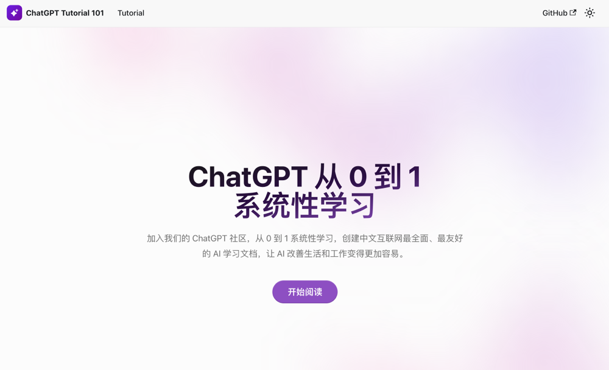

# ChatGPT Tutorial 101：从 0 到 1 系统性学习资料

这是一个由 Spark 闪闪团队发起的开源中文 ChatGPT 教程文档及社区，旨在帮助所有 GPT 学习者在 AI 时代到来的当下更好地利用 ChatGPT 等工具提高自身的工作、学习效率、更好地享受生活。

虽然叫做「ChatGPT」教程，但我们的内容同样适用于「文心一言」等基于 GPT 的 AI 产品。

文档链接：[点击开始阅读文档](https://gptdoc.sparkai.chat/)

## 勇者招募

我们的目标是做成至少在中文互联网里质量最高、最详细的 ChatGPT 文档，但由于我们团队的几位作者终究是时间有限，我们希望更多的有志之士能够加入我们和我们一起做这个文档。如果你对 ChatGPT 这件事情很感兴趣并且每周能固定拿出 3 小时以上投入到文档里，我们诚挚邀请你加入我们。

（之前本来放的微信 & 企业微信，结果都被封，无语😓）

## 文档介绍

### 文档可能更适合

1. **已入门者**，想要进行系统性学习
2. **未来的从业者**，在寻找能够夯实基础但有不那么晦涩的资料
3. **未来的创业者**，在寻找 GPT 带来的机会

如果你已经开始使用 ChatGPT 或者这一类的基于 GPT 的聊天机器人产品，厌倦了那些让机器人扮作占星师之类的「奇技淫巧」，想要更加深入地了解以改善自己的工作、学习效率，但苦于当下难以找到系统性学习资料，那么这个文档可能会适合你；

### 这个文档不适合

* **这不是个“魔法手册”**：

如果你是纯粹的「小白」用户，只是在各大社交媒体上听说了「ChatGPT」，并且非它不用，目前没有办法解决网络、账号、ip 等问题，很抱歉，这个文档没有可以解决这一类问题的内容。但是，你如果虽然不能直接使用 ChatGPT，但正在使用「文心一言」等产品，这个文档的知识同样适用。

* **这也不是个“游戏攻略”**：

如果你是一个纯粹的玩家，也不关心 ChatGPT 的是什么、为什么和能干什么，那么这个文档可能不太适合你。在这个文档里我们比较少地提及了具体的操作步骤，比如，怎么魔法上网，怎么注册账号，怎么把 ChatGPT 接入 Siri 或者和 midjourney 一起生成图片，而且网络上已经有足够多的这一类的教程，我们就不过多赘述了。

* **不是个代码教学教程**：

如果你是正在寻找一个本地部署大语言模型的代码教程，那么这个教程同样可能也帮不到你。虽然在这个文档里提及了非常多 NLP、大语言模型的知识，但极少地涉及具体的代码。

[点击开始阅读文档](https://gptdoc.sparkai.chat/)