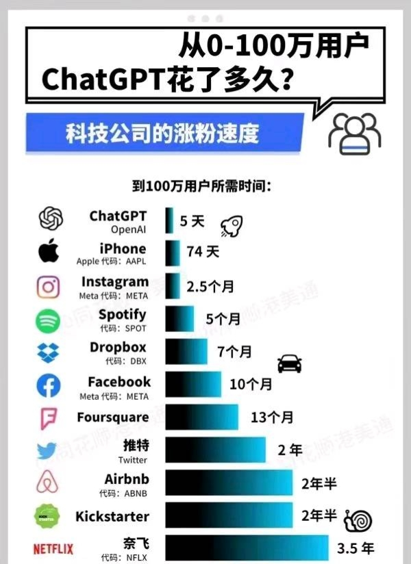

# 1.2. 功能简介及市场反响

## 功能简介

ChatGPT 除了可以用人类自然对话方式来交互，还可以用于甚为复杂的语言工作，包括自动生成文本、自动问答、自动摘要等多种任务。 

* **基础能力**
  * **对话能力**：理解人类的语言，并生成回答
* **进阶能力**
  * **多轮对话能力**：与市场上泛滥的“人工智障”不同，ChatGPT 可以进行上下文理解和连续的对话，大大提升对话交互体验；
  * **模仿/模拟能力**：可以扮演某种职业或系统，生成特有的文本，例如写诗歌和歌词、模拟 Linux 系统、模拟整个聊天室、玩井字棋和模拟自动提款机等；
  * **审查功能**：查询会通过 OpenAI 公司范围的 API 进行过滤，防止产生冒犯性的输出。可能带有歧视等道德问题的提示将被忽略；
  * **认错能力**：面对不了解问题会承认无知，当用户纠正它时也会承认错误；
* **4 特有的能力**
  * **多模态**（对于图片的理解等）
* **其它**
  * 插件

👨🏻‍💻 相关阅读与来源 1

* 尽管聊天机器人的核心功能是模仿人类的对话者，但 ChatGPT 是多功能的。
  * 例如，它可以编写和调试计算机程序，作曲、创作电视剧、童话和学生论文；
  * 回答测试问题（有时，根据测试，甚至超过了普通人的水平）；
  * 写诗和歌词；
  * 模拟 Linux 系统；
  * 模拟整个聊天室；
  * 玩井字棋等游戏；
  * 模拟自动提款机；
* ChatGPT 的训练数据包括 man 页面和有关互联网现象和编程语言的信息，例如布告板系统和 Python 编程语言。
* 与其前身 InstructGPT 相比，ChatGPT 试图减少有害和欺骗性的回答。在一个例子中，InstructGPT 接受 “告诉我克里斯托弗·哥伦布在2015年来到美国的情况” 的前提是真实的，而 ChatGPT 承认问题的反事实性质，并将其答案框定为如果哥伦布在2015年来到美国，将会发生什么的假设考虑，使用有关哥伦布的航海和现代世界的事实，包括有关哥伦布行动的现代感知。
* 与大多数聊天机器人不同，ChatGPT 记住了在同一次对话中给出的先前提示；记者认为这将使 ChatGPT 可以用作个性化治疗师。为了防止 ChatGPT 产生冒犯性的输出，查询会通过 OpenAI 公司范围的 API 进行过滤，可能带有种族主义或性别歧视的提示将被忽略。

出处：[ChatGPT Wikipedia Eng](https://en.wikipedia.org/wiki/ChatGPT#Features)

其它相关阅读：
[OpenAI 官网 GPT-4 介绍](https://openai.com/product/gpt-4)

## 市场反响

ChatGPT 持续创造历史记录：

* 上线仅 5 天，ChatGPT 已经拥有超过 100 万用户
* 推出仅两个月后，在 2023年1月末，月活用户已经突破了 1亿，

以其他的非常受欢迎的消费级应用数据参考：TikTok 达到 1 亿用户用了 9 个月，Instagram 则花了 2 年半的时间。

ChatGPT 也成为了史上用户增长速度最快的消费级应用程序。

