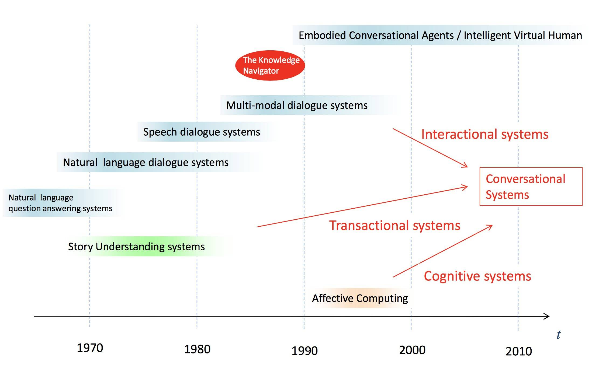
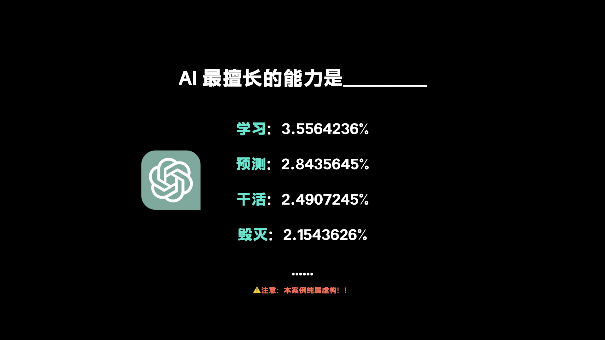
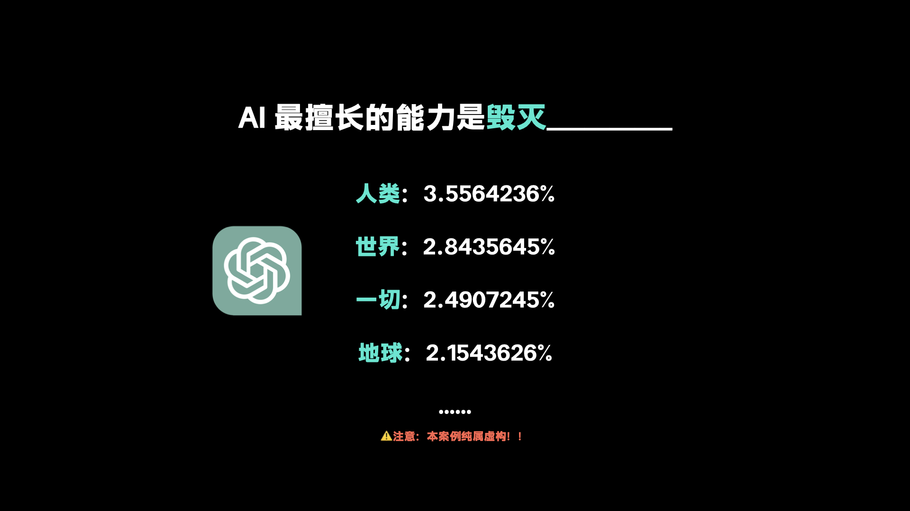
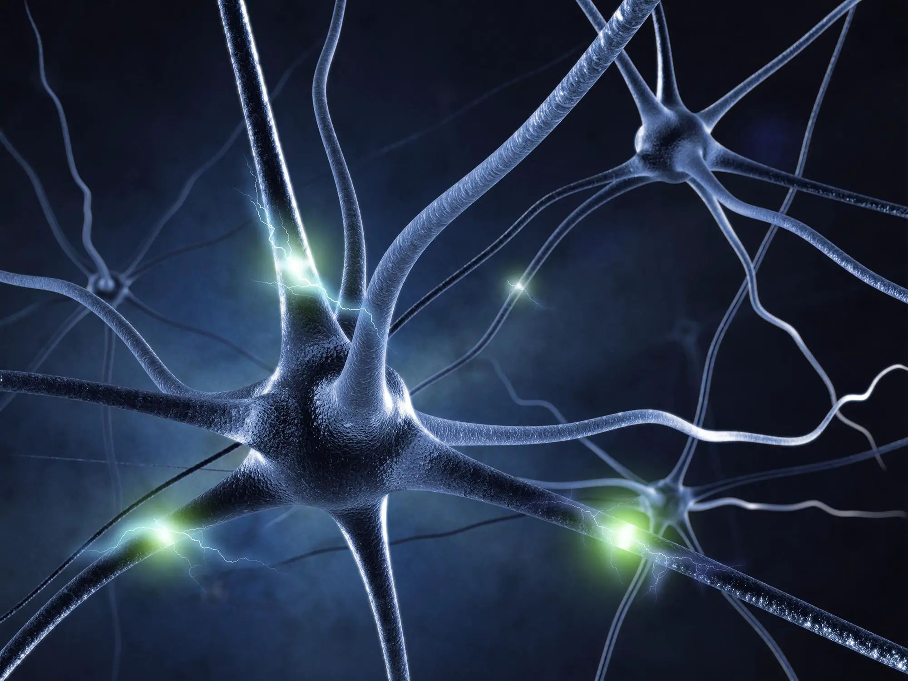
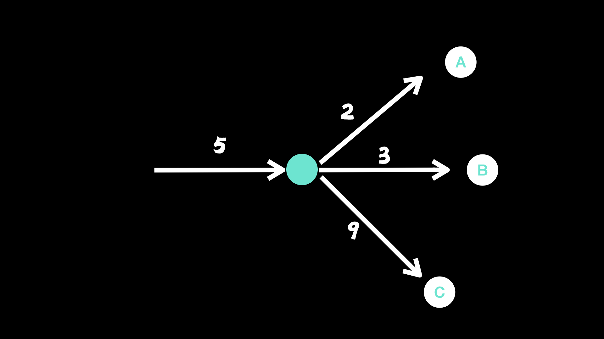
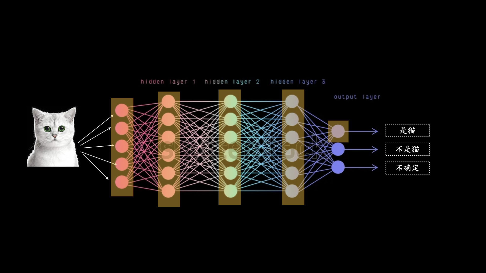

# 2.1. 【小白向】详细原理解释

本文的视频版本：
- [bilibili](https://www.bilibili.com/video/BV1vg4y1u7UT/)
- [youtube 上传中]()

## 前言

虽然 ChatGPT 最近才爆火，但其实对话式人工智能是一个人类研究非常久的领域了，几十年前 Lunar 等等各种自然语言对话系统就在不断地被迭代和研发了。

虽然研究时间长、投入力量大，但对话式人工智能始终被认为最难被突破的 AI 技术之一，这其中主要有两个难点：

1. 人类的语言天然就是不精确的，无论是中文还是英语还是意大利语，都存在许多歧义和模糊；
2. 人类的对话非常依赖上下文，同样的内容放在不同的上下文中是完全不同的意思；

这也是为什么在之前最顶尖的科技公司们开发出来的智能音箱被大家称作「人工智障」，那为什么 ChatGPT 可以吊打 Siri、小爱同学们呢？

ChatGPT 底层所使用的技术，是一种叫做 Generative Pre-trained Transformer 的语言模型，简称 GPT，这个系列语言模型最初由 OpenAI 在2018年推出。从那时候开始，OpenAI 一直在对模型进行改进，目前历经 1、2、3、4 代，也被称为 GPT1、GPT2 等。

本来前两代 GPT 所展现的效果和 Google 的 Bert 模型不相上下甚至稍逊一筹，但直到 GPT3 所使用的训练数据量急速加大之后所涌现的爆炸式能力提升，让业界发现这玩意儿太强了吧。再到 ChatGPT 发布，普通人也可以开始使用，后面的故事大家都知道了。

## GPT 原理的最简单解释

最简单地一句话概括 GPT 的技术原理是：“每次算一个词出来”。

ChatGPT 始终基本上是在对于已有文字产生一种“合理的延续”，无论它得到的文本是什么。

想象一下，有一台超级计算机，扫描了所有人类的文本之后，可以猜出每一段话出现后、下一个单词最可能是什么。 ChatGPT 实际上做了类似的事情。

我们假设一个填空题，「AI 最擅长的能力是 ——」。ChatGPT 会算出一个可能的单词排名列表，这些单词最可能跟在文本后面，以及“概率”：

当每次 ChatGPT 填好一个词之后，我马上就又把填了一个词的这个句子再次给它：

于是在一次一次的任务重复中，ChatGPT 完成了一整个长句。

当我们给 ChatGPT 一个问题之后，就是同样的道理，它其实是在用我们的问题作为起点，一个词一个词地填出答案来。

## 概率怎么算

好的，ChatGPT总是基于概率选择下一个单词。但这些概率从哪里来？

直觉思考的话，能够获得概率的方法就是统计每个字在所有文本之中出现的频次了，但是如果是这样的话，整个句子里就会出现一大堆的高频词，比如在中文里，就是「你我他」、「是」、「不是」之类的词。

那么我们在往前一步，我们可以统计每个词在出现一段特定长度句子之后的频次，比如这句话：

> 今天天气真好，我心情也很 _____

可能「好」、「不错」等词出现的频率就会很高，但是「不好」、「糟糕」甚至「洗衣机」等其它的词出现频率就会很低。

而另一句话:

> 今天天气非常差，我心情也 _____
 
这时「不好」、「糟糕」就变成了概率最高的词。

对于 ChatGPT 来说，读完前面的句子后，直接取下一个出现概率最高的词就好。

但是，这又会出现另外一个问题，为了让 ChatGPT 见过尽可能多的单词组合，在 ChatGPT 所使用的训练数据集里，光网上爬下来的就有几百亿个单词，再加上书里的单词，总计可能有几千亿个单词。

如果我们要算每个单词在一段话之后的频次，这个计算量就会指数级地提高，如果每个单词前面的那段话超过 10 个词，可能所需要的计算量整个地球的计算机加起来都要算到宇宙毁灭。

为了解决这个问题，于是科学家们引进了模型。也可以叫做算法，或者更简单的说法，函数。

我们回想一下，初中物理课上学的抛物线是怎么算的。

一个小球从地上被往上抛起，我们并不需要每次改变一点点条件就都要去重新测量小球上升或者下降了多少米，我们摸清楚它的规律之后，总结了一个函数：

`y = ax^2 + bx + c`

根据不同的情况，我们赋予参数 a、b、c 不同的值，就可以根据 x 算出来 y 的值。

同样的，我们可以将上面那个要算到宇宙毁灭的任务理解为一个要去计算一个更复杂的抛物线，x 是「今天天气真好，我心情也很——」，而 y 是「不错」或者「糟糕」等特定单词出现的概率。

为了计算出每一句话之后每一个单词出现的概率，现在我们不是要去真的计算每个词每个句子，而是尝试去总结一个函数出来。

这也是 ChatGPT 的基础结构，一个函数。只不过，这个函数有一些特别的地方，在 OpenAI 公开的研究内容中来看，GPT-3 模型有 1750 亿个参数。我们并不是像算抛物线一样，可以人工地赋值给 abc，那可是 1750 亿，此时，神经网络登场了。

## 神经网络

我们在很多领域都遇到了这样的「复杂函数」问题，比如说图像识别，于是科学家们开始参考大脑的结构来解决这样的复杂函数问题。

从字面上看就知道，神经网络是在计算机中模拟大脑的工作方式。

当我们观察人类的大脑，可以看到，大脑基本是由神经元组成的，然后在神经元之间有一个薄弱的连接，电信号在其中传播，大概是这个样子：

对于任意一个神经元来说，神经元周围的各个方向都有连接，然后神经元通过这些连接接收上一个神经元传递过来的信号，处理之后再把信号传递给下一个或者下几个。

当所有的神经元作为一个整体运转的时候，它就成为了你的大脑。比如当我们右脚小脚拇指撞到了桌腿、或者看到路边的一只可爱小猫，我们的身体将接收到的信息转化为电信号，然后发送到大脑和大脑神经元，相关的神经元就会被激活，被信号击中、然后传播到下一个连接的神经元，最终在你的大脑里产生感受、或者思考、或者结论。

计算机科学家们将这一整套的大脑运作机制简化成了一个非常非常简单的模型，我们还是先关注某一个特定的神经元，假设关注某一个特定的神经元收到了一个信号。

从 0 到 9 给信号的强度排序，0 非常弱，9 是非常强的信号，而此时，我们这个神经元收到了强度为 5 的信号，经过简单的处理，它决定把信号 2 发给神经元 a，信号 3 给神经元 b，信号 9 给神经元 c。

而假设这个神经元是最后一个输出的，而 abc 是一道选择题的三个选项，那么这个神经元对于信号的答案就大概率是 c 了。

就这样，一个最基础的神经元模拟就完成了。

如果我们再创建许多个这样的神经元，堆积成层，再一层一层叠起来，就构成了我们人造的神经网络。

它虽然是简化的单向版本，不像真正的大脑一样神经元还可以传回信息给之前已经传递过信息的神经元，但目前这个神经网络就可以开始运作了，最早的神经网络成功案例是图像识别。

比如我们要判定，一张图片里是不是猫，将这张图片用像素的方式输入神经网络之后，神经网络会一层一层地开始激活，也就是传递电信号，最终在结果层告诉你答案。

但是，就这样随便搞搞就能直接构建一个告诉你正确答案的模型吗？

## 训练

当然不是，刚开始的时候构建出的这一大堆神经元都是瞎传递信息的。

人类需要先训练这个神经网络，就像我们在教育小孩的时候，会一遍一遍地告诉 ta，哪个是小汽车，哪个是小猫咪。对于神经网络也同样如此，我们会先拿出几万张甚至几十万张猫、狗、猪、洗衣机、微波炉的照片给它，并告诉它正确答案。

在每一次的训练中，它都会稍微改变一下神经元们激活的路径，直到一次又一次的训练后，这个神经网络神奇地学会了怎么识别猫，每一次不同的图片传输进来，它好像都能够找到正确的信号激活路径然后给出正确答案。

我们也许可以说神经网络正在“挑选某些特征”，比如尖耳朵，并利用这些特征来确定图像的内容。但这些特征是比如“尖耳朵”这样的我们可以描述出来的特征吗？

大多数情况下并不是的。大多数情况下我们没有一种“给出叙述性描述”的方式来描述我们大脑的推理方式，或者说神经网络正在做什么。这也是为什么都在说现在的 AI 是不可解释的，是黑盒子。

著名学者兼企业家 Wolfram 对此说道：

>也许这是因为它真的是计算上不可简化的，没有一般的方法可以找出它的行为，除非我们明确地追踪每一步。或者也许只是因为我们还没有“找到科学方法”，并确定了“自然法则”，使我们能够总结正在发生的事情。

但 Anyway，我们这种人造的神经网络在经过大量训练之后，可以开始识别出猫了。

而当我们回到之前聊到的 ChatGPT 所使用的复杂函数上来，神经网络也同样被应用到了构造那个复杂函数上。

## 无监督学习与监督学习

GPT 所使用的神经网络架构叫做 Transformer，在这里我们可以暂时不用关注 Transformer 的技术细节，只需要知道它是谷歌搞的，很强，取代了之前的架构就好。

GPT 基于 Transformer 构建了一个大型的神经网络，然后从人类已经在互联网上或者书籍里产生的内容里挑选了一部分质量较高的文本，扔到了这个神经网络里，开始训练它。这个过程被称为「预训练」，也因为没有人类的介入被称为「无监督学习」。

这就像你在读书或者听课时候一样的，你在不停地摄入知识。

一旦它从原始文本语料库中完成了预训练，ChatGPT 内部的神经网络就准备开始生成自己的文本，从提示等继续生成。但是，虽然这些结果经常看起来合理，但它们往往会“偏离”人类的方式——特别是对于更长的文本。这不是通过对文本进行传统统计可以轻松检测到的。

这个时候，就需要「监督式学习」的方法介入了。OpenAI 找来了许多许多的人，然后让他们给 ChatGPT 所生成的答案打分，ChatGPT 也就会根据所得到的分数再次向更好迈进。

这和你学完书本和课程上的知识之后需要做习题、参加考试一个道理，在「监督学习」的训练方式下，ChatGPT 和我们一样都成长了，都有美好的未来。

当然，这个训练过程并没有说起来这么简单，OpenAI 在这个过程还有 fine-tuning、RLHF、用较小算力预测 Loss 指导训练等等等等方法，我们在这里就不深究细节了。

## 总结

完成了各种训练之后，那个 1750 亿参数的函数也就被训练出来了，而机器也可以开始正确地选出下一个词是什么了，那么一个 ChatGPT 也差不多就成型了，成为了当下这个令人震惊的对话式人工智能。

其实和很多搞 NLP 或者机器学习的朋友聊，他们都在说，算法层面上其实并没有什么颠覆式的突破，但数据量的增加带来的一切太出乎意料了。据说 OpenAI 内部对于提升数据量之后这股「涌现」出来的能力也感到非常惊讶，就好像忽然突破了某个阈值，AI 就进化成另一个新物种了。

正如微软研究院各位科学家所最新出的一篇叫做《[Spark of Artificial General Intelligence: Early Experiments with GPT-4](../%E5%8F%82%E8%80%83%E6%96%87%E6%A1%A3%E5%90%88%E9%9B%86/pdf-sparks-of-artificial-general-intelligence-early-experiments-with-gpt-4.md)》的论文，我们在 GPT-4 身上看到了通用人工智能的星星之火。

推荐阅读：

- Stephen Wolfram: What Is ChatGPT Doing … and Why Does It Work? [点击阅读中文版](../%E5%8F%82%E8%80%83%E6%96%87%E6%A1%A3%E5%90%88%E9%9B%86/Wolfram%EF%BC%9AChatGPT%E5%9C%A8%E5%81%9A%E4%BB%80%E4%B9%88...%E4%BB%A5%E5%8F%8A%E5%AE%83%E4%B8%BA%E4%BB%80%E4%B9%88%E6%9C%89%E6%95%88)
- OpenAI: GPT-4 Technical Report [点击阅读](https://cdn.openai.com/papers/gpt-4.pdf)
- Juergen Schmidhuber: Deep Learning in Neural Networks: An Overview [点击阅读论文](https://arxiv.org/abs/1404.7828)
- Google: Attention Is All You Need [点击阅读论文](https://arxiv.org/abs/1706.03762)
- OpenAI: Training language models to follow instructions with human feedback [点击阅读论文](https://arxiv.org/abs/2203.02155)