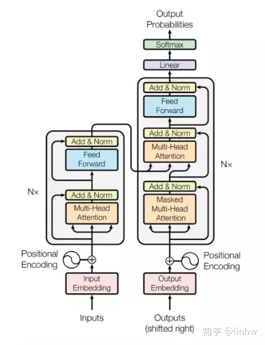

# 2.2. 自然语言模型与发展历程：Transformer、BERT 与 GPT

<mark style={{backgroundColor:"orange"}}><b>可以理解为自然语言模型是人类所设计的一种机器人</b></mark>**，它可以做自然语言处理**，为了实现这个机器人，我们需要：

1. **设计一个算法**，机器人拿到一堆文本之后，他应该在机器内部做哪些计算，计算出一个什么样的结果输出出来；
2. **用足够多的数据训练它并告诉它正确答案**，类比人类，当你学会了一类数学题的公式之后，你需要做足够多的正确的练习才能掌握；

## 自然语言发展简史

* 统计语言模型：以统计词频为主要手段的 n-gram模型，只能建立短程依赖，非常受到数据集的影响
* 2010 年，RNN（Recurrent Neural Network）
* 2013 年，word2vec：将每个词变成一个向量
* <mark style={{backgroundColor:"orange"}}>2017 年，Transformer：是当下 GPT 盛世的转折点</mark>，改变了以往序列建模和 RNN 划等号的思路，整个结构完全由注意力机制和前馈神经网络构成，架构如下：

* 2018 年，GPT：GPT 系列的起点，利用了 Transformer 的解码器部分作为特征提取，可以理解是让机器做文本续写
* 2018 年，BERT：利用了 Transformer 的编码器部分，对训练集进行双向训练，可以理解是让机器做完形填空

相关阅读：

[NLP 模型发展简要史：从 bags of words 到 Transformer 家族](../%E5%8F%82%E8%80%83%E6%96%87%E6%A1%A3%E5%90%88%E9%9B%86/NLP-%E6%A8%A1%E5%9E%8B%E5%8F%91%E5%B1%95%E7%AE%80%E8%A6%81%E5%8F%B2-%E4%BB%8E-bags-of-words-%E5%88%B0-Transformer-%E5%AE%B6%E6%97%8F.md "mention")

[Transformer 论文逐段精度](../%E5%8F%82%E8%80%83%E6%96%87%E6%A1%A3%E5%90%88%E9%9B%86/Transformer-%E8%AE%BA%E6%96%87%E9%80%90%E6%AE%B5%E7%B2%BE%E5%BA%A6.md "mention")

