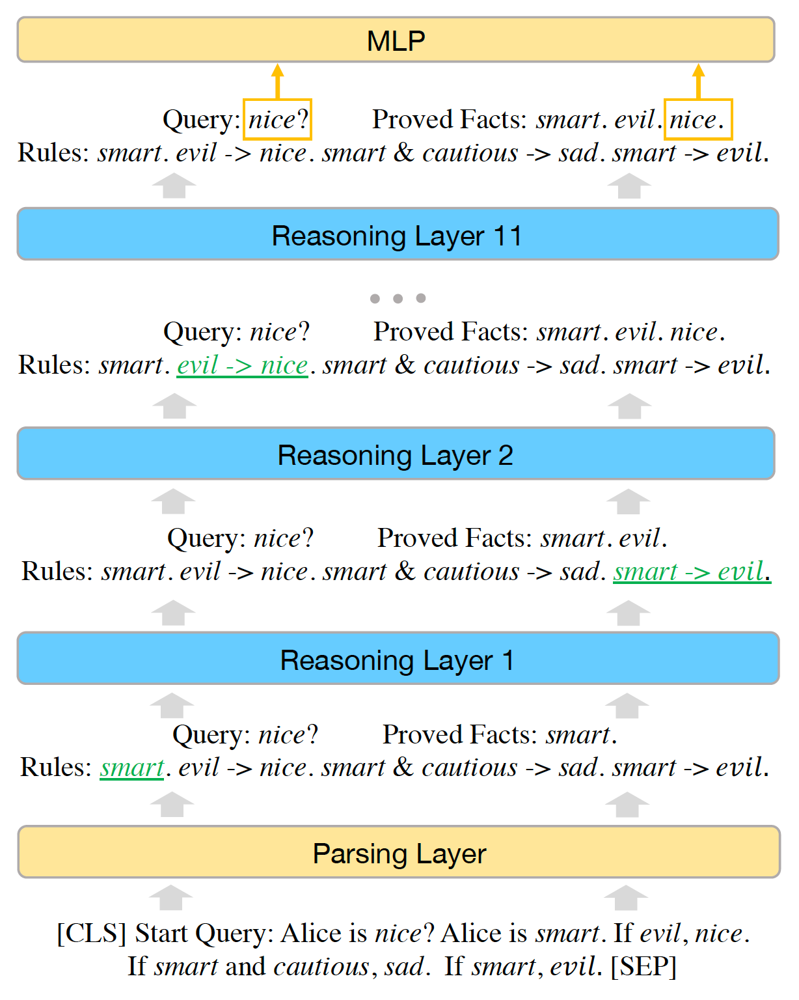

# 2.4. 新范式时代：LLM、AGI 与展望（2020 -）

## 基础概念

* **LLM（Large Language Model**）：<mark style={{backgroundColor:"orange"}}><b>一个大型语言模型（LLM）是一个由神经网络组成的语言模型</b></mark>，具有许多参数（通常是数十亿个或更多的权重），使用自监督学习在大量未标记的文本上进行训练。<mark style={{backgroundColor:"orange"}}><b>目前 GPT 是 LLM 中表现最好的一种</b></mark>。
* **AGI（Artificial General Intelligence）**：人工通用智能（AGI）是指智能体理解或学习人类或其他动物能够完成的任何智力任务的能力。这是一些人工智能研究的主要目标，也是科幻和未来研究中的常见主题。<mark style={{backgroundColor:"orange"}}><b>AGI 也被称为强人工智能、完全人工智能或通用智能行动</b></mark>，但一些学术来源将“强人工智能”一词保留给能够体验感知或意识的计算机程序。
*   为什么放在一起说：

    * 可以说，人类在 AI 领域探索的重点就是创建 AGI
    * 本来近些年对于「在可预见的时间里到达 AGI」这件事情是相对悲观
    * 而因为 LLM 在近几年的表现和 ChatGPT 的出现，还有使用 zero shot prompting/few shot prompting 的特性、再加上加大训练数据量之后所「涌现」出来的能力，<mark style={{backgroundColor:"orange"}}><b>忽然给 AGI 带来了曙光</b></mark>
    * 就连微软研究中心的大神们也评价道：「GPT-4可被视作**AGI** （通用人工智能）的早期版本」（详见下方论文）


<figure></img><figcaption></figcaption></figure>

[PDF：Sparks of Artificial General Intelligence: Early experiments with GPT-4](../%E5%8F%82%E8%80%83%E6%96%87%E6%A1%A3%E5%90%88%E9%9B%86/PDF-Sparks-of-Artificial-General-Intelligence-Early-experiments-with-GPT-4 "mention")


## 当下 LLM 取得的成果

* <mark style={{backgroundColor:"orange"}}><b>涌现（Emergent Ability）</b></mark>：LLM 展现了一些只有规模必须得增大到一定程度会突然显现的能力；下图是不同 LLM 在数据规模指数型增加时面对不同问题的能力表现：

<figure></img><figcaption></figcaption></figure>

* <mark style={{backgroundColor:"orange"}}><b>上下文学习能力（In-Context Learning）</b></mark>：也有人称之为少样本学习能力、或者泛化通用能力。这项能力简单来说就是，预训练好的模型在迁移到新任务上的时候并不需要重新训练，而只需要提供任务描述接着提供几个示例，最后加上要模型回答的查询。将以上内容打包一起作为模型的输入，则模型就能输出一个非常不错的答案；（Zero-shot/Few-shot Prompting 会在 5.1 「Prompt 工程」一节中详细提及）下图是一个翻译的例子：

<figure></img><figcaption></figcaption></figure>

* <mark style={{backgroundColor:"orange"}}><b>复杂逻辑推理能力</b></mark>：不同于以往的「人工智障」的还有一个很强的能力在于，LLM 表现出强很多的逻辑推理能力。面对问题，LLM 似乎可以进行逻辑推理，解决那些单纯用模式匹配根本无法完成的任务。例如 LLM 可以像人类一样一步一步思考来回答你的答案（思维链 COT 相关内容会在 5.1 「Prompt 工程」一节中详细提及）：



但在[《Emergent Abilities of Large Language Models》](https://www.notion.so/PDF-Emergent-Abilities-of-Large-Language-Models-1c1257029a5043d59349e6bf4dbd503a)论文中也有提到，大语言模型在逻辑推理和因果推断中，具有涌现特征的比例最低，可能反映了语言模型并没有真正把握因果关系。

* AGI 展望
  *   OpenAI CEO Sam Altman 定义的 AGI

      > AGI is basically the equivalent of a median human that you could hire as a co-worker, they could like do anything that you’d be happy with a remote co-worker doing just behind a computer, which includes learning how to go be a doctor, how to go be a very competent coder. I think one of the skills of an AGI is not any particular milestone but the meta skill of learning to figure things out and it can go decide to get good at whatever you need. （AGI基本上相当于一个中等人类的水平，你可以雇佣他作为同事，他们可以做任何你希望一个远程同事能够做的事情，只需要在电脑后面，包括学习如何成为医生，如何成为一个非常有能力的编码人员。我认为AGI的一个技能不是任何特定的里程碑，而是学习解决问题的元技能，它可以决定学习任何你需要的技能。）


  * ```jsx
    $todo$
    ```


相关阅读：

[【强烈推荐】通向AGI之路：大型语言模型（LLM）技术精要](../%E5%8F%82%E8%80%83%E6%96%87%E6%A1%A3%E5%90%88%E9%9B%86/%E5%BC%BA%E7%83%88%E6%8E%A8%E8%8D%90-%E9%80%9A%E5%90%91AGI%E4%B9%8B%E8%B7%AF-%E5%A4%A7%E5%9E%8B%E8%AF%AD%E8%A8%80%E6%A8%A1%E5%9E%8B-LLM-%E6%8A%80%E6%9C%AF%E7%B2%BE%E8%A6%81 "mention")

[PDF：Sparks of Artificial General Intelligence: Early experiments with GPT-4](../%E5%8F%82%E8%80%83%E6%96%87%E6%A1%A3%E5%90%88%E9%9B%86/PDF-Sparks-of-Artificial-General-Intelligence-Early-experiments-with-GPT-4 "mention")

[PDF：Emergent Abilities of Large Language Models](../%E5%8F%82%E8%80%83%E6%96%87%E6%A1%A3%E5%90%88%E9%9B%86/PDF-Emergent-Abilities-of-Large-Language-Models "mention")

[OpenAI CEO Sam Altman 2022.07 采访](../%E5%8F%82%E8%80%83%E6%96%87%E6%A1%A3%E5%90%88%E9%9B%86/OpenAI-CEO-Sam-Altman-2022-07-%E9%87%87%E8%AE%BF "mention")

