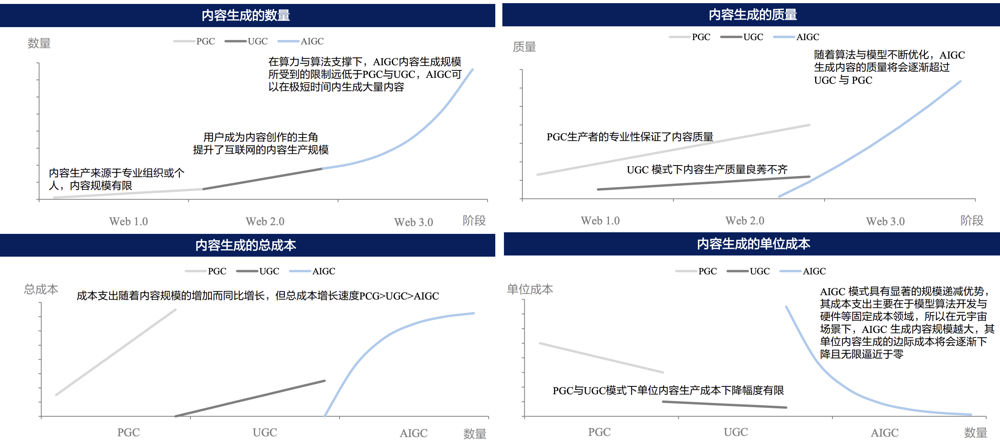
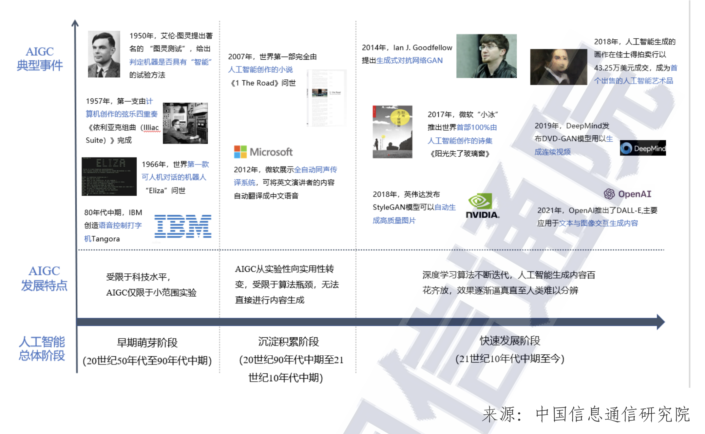

# 3.2. 行业概览与发展历程

首先我们想下一个可能略有些鲁莽的推断：<mark style={{backgroundColor:"orange"}}>ChatGPT 的到来意味着新一代的人与信息交互方式的开启。</mark>

回顾历史，每一次人与信息交互方式发生改变时，都带来了巨大的变革，也诞生了伟大的公司：
|变革|代表产品|交互方式的改变|
|----|----|----|
|即时通信|电话、短信、MSN、QQ、微信|人与人之间的单点到单点的信息即时传递|
|PC 操作系统|Macintosh、Windows；|人类对于复杂信息处理能力和效率提升|
|互联网浏览器|IE、网景、Chrome；|单个人类可获取信息量的巨量提升|
|门户网站|Yahoo、搜狐、新浪；|面对海量信息时，快速选择信息，提升人获取信息效率|
|搜索引擎|Google、Bing、百度；|有明确信息获取需求时，帮助快速寻找信息，提升人获取信息效率|
|社交媒体|Twitter、Facebook、微博；|开启 UGC 时代，普通人可发布信息，再次提升单个人类获取信息量|
|智能手机|iPhone；|开启移动互联网时代，让更多人可以随时随地获取互联网海量信息|
|推荐引擎|Facebook、今日头条、抖音|所谓「千人千面」，根据单个人喜好推送更符合ta需求的信息，提升人获取信息的效率|

到 ChatGPT 和 Stable Diffusion 们所带来的信息创作成本极速下降的现在，信息的量级将会极速地膨胀起来。

同时，我们认为， ChatGPT 的信息处理能力很有可能在未来会成为我们的个人助手，而个人助手面对更海量的信息，它能够筛选并处理，再以我们人类更易读地方式返回给我们，从而再次提升人获取信息的效率。

也许就在现在，GPT 正在创造出一个新的万亿市场的行业，但如果要纵览发展脉络以更好地用惯性预测可见的未来，也许「AIGC」是条不错的线索。

## AIGC

AIGC 全称 “Artificial Intelligence Generated Content”，也就是 AI 来创造内容。

与 AIGC 相对应的概念中，比较熟知的还有 PGC（Professional Generated Content，专业人员创作内容）和 UGC（User Generated Content，用户自己创造内容）。

在 Google 去年释出 Stable Diffusion 以及各 AI 图像生成的工具出现后，AIGC 这个概念就开始极为火爆。主要原因是相比传统的 PGC、UGC 模式受到成本限制、质量和规模已经隐约到达了一个瓶颈，而在对于“元宇宙”的憧憬下，AIGC 的极低边际效益代表着无限的可能。

AIGC发展可分为三阶段，早期萌芽阶段（上世纪50年代至90年代中期），沉淀累积阶段（上世纪90年代至本世纪10年代中期），快速发展阶段 （本世纪10年代中期至今）。

**早期萌芽阶段（1950s-1990s）**

由于技术限制AIGC仅限于小范围实验与应用，1957年出现首支电脑创作的音乐作品，弦乐四重奏《依利亚克组曲（Illiac Suite）》，80年代末至90年代中由于高成本及难以商业化，因此资本投入有限导致AIGC无较多较大成绩。

**沉淀累积阶段（1990s-2010s）**

AIGC从实验性转向实用性，2006年深度学习算法取得进展，同时GPU,CPU等算力设备日益精进，互联网快速发展，为各类人工智能算法提供海量数据进行训练。2007年首部人工智能装置完成的小说《I The Road》（《在路上》）问世，2012年微软展示全自动同声传译系统，主要基于“深度神经网络”（Deep Neural Network，DNN）自动将英文讲话内容通过语音识别等技术生成中文。

**快速发展阶段（2010s至今）**

2014年深度学习算法“生成式对抗网络”（Generative Adversarial Network, GAN）推出并迭代更新，助力 AIGC 新发展。2017年微软人工智能少年“小冰”推出世界首部由人工智能写作的诗集《阳光失了玻璃窗》，2018 年 NVIDIA(英伟达)发布 StyleGAN 模型可自动生成图片，2019 年 DeepMind 发布 DVD-GAN 模型可生成连续视频。2021 年 Open AI 推出 DALL-E 并更新迭代版本 DALL-E-2，主要用于文本、图像的交互生成内容。

我国 AIGC 市场在 2022 年底引起较大关注，2023 年开年企业端跃跃欲试。虽然行业仍处于起步阶段，距离大规模证明和体系化发展仍有距离，但从资本的加码到应用场景的探索，距离的缝隙有望逐步填补，同时，“模块分拆+个性化推荐”的“泛AIGC”形式有望持续发展。

更多阅读：
- [中国通信院AIGC白皮书](http://www.caict.ac.cn/sytj/202209/P020220913580752910299.pdf)