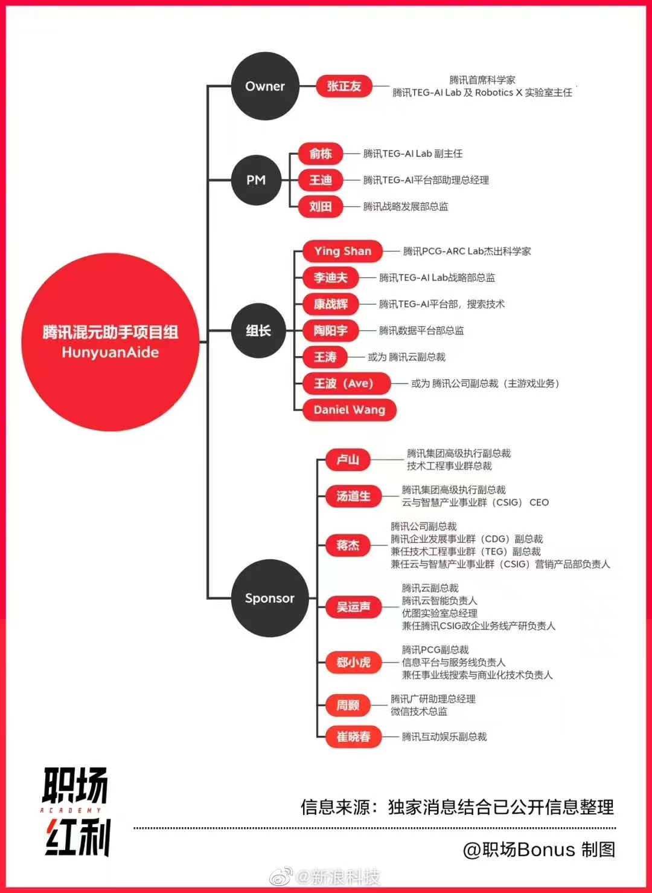

# 中游：模型

在认为未来少数 AGI 是会一统天下、形成类似于如今 iOS、Android 的局面的前提下，有人说模型的产业里会有三张船票，OpenAI 已经拿到一张了，在中国大家会去抢一张，世界范围内还会去抢一张。

暂且不论这个说法正确与否，我们可以一起先来看看这些竞争者。

## 中国

#### <mark style={{backgroundColor:"orange"}}>传统大厂：百度文心一言</mark>

国内对于 LLM 投入最早也最大的企业，人才、资金、数据、技术等多方面的储备也是领先于国内各大厂商，这也是为何 ChatGPT 发布后，短短几个月时间文心一言就能够发布。

关键人物：百度 CTO 王海峰

底层模型及架构：新一代知识增强大语言模型，在ERNIE及PLATO系列模型的基础上研发，关键技术包括有监督精调、人类反馈的强化学习、提示、知识增强、检索增强和对话增强

算力：“鹏城云脑I”4,096颗HUAWEI Ascend 910 AI处理器和2,048颗驾鹏920 CPU处理器，可提供1E OPS智能算力即不低于每秒100亿次操作的AI计算能力:为了支持千亿参数模型的高效分布式训练，飞粱研发了4D混合并行技术

参数：发布会未公布

数据量：万亿级网页数据、数十亿搜索数据和图片数据、百亿级语音日均调用数据，以及5500亿事实的知识图谱等

网址：[https://yiyan.baidu.com/](https://yiyan.baidu.com/)

#### <mark style={{backgroundColor:"orange"}}>传统大厂：华为盘古大模型</mark>

华为较早进入大模型领域，提出 CANN、MindSpore框架、ModelArts 平台等不同层级的协同优化，为盘古大模型提供了强大的背后支撑

目前 To B 端应用较广泛，主要应用于智能舆情及智能营销 (NLP大模型)。

关键人物：华为云人工智能领域首席科学家 田奇

底层模型及架构：在模型结构上，盘古采用Encode和Decode的架构，保证了其在生成和理解上的性能

算力：华为联合鹏城实验室联合打造“鹏城云脑II”，是我国首个国产E级AI算力平台;盘古大模型在训练时调用了超过2000块异腾910进行了两个多月的训练，可以提供超过640P FLOPS的FP16

参数：千亿级参数量-NLP (盘古大模型整体为2,600亿参数量);30亿参数的视觉 (CV) 预训练模型

数据量：40T中文文本数据量 (截止2021年5月统计)

#### <mark style={{backgroundColor:"orange"}}>传统大厂：腾讯混元大模型</mark>

据说研发进度较慢

#### <mark style={{backgroundColor:"orange"}}>创业公司：光年之外</mark>

于 2023 年初创立，目前公司处于招兵买马阶段，北京智源人工智能研究院副院长刘江已加入，前Google总部科学家、世界级自然语言处理及人工智能专家李志飞已加入。目前产品未知。

关键人物：美团联合创始人、人人网联合创始人王慧文

王慧文 2023年2月13日 在朋友圈发言

> 关于人工智能到现在为止，我只有一个判断，必须参与
>
> 5,000万美元带资入组，不在意岗位、薪资和title，求组队

#### <mark style={{backgroundColor:"orange"}}>创业公司：北京稀宇科技（MiniMax）</mark>

商汤系创业项目，宣传首家三模态 AI 大模型，目前已推出虚拟人产品 GLOW，月活过百万，toB 产品正在研发中。

关键人物：

* 前商汤研究院副院长闫俊杰
* 前 Uber 的 AI 研究院成员杨斌

#### <mark style={{backgroundColor:"orange"}}>科研院所：智源研究院</mark>

由北京智源人工智能研究院牵头，智谱 AI 等多家机构共同研发悟道 2.0，参数规模达到 1.75 万亿个，可以同时处理中英文和图片数据，现悟道已开源

已与美团、小米、快手、360、搜狗、寒武纪、第四范式、推想科技、好未来、小冰科技等达成合作共建模型生态

关键人物：

* 黄铁军：北京智源人工智能研究院院长、北京大学信息科学技术学院教授
* 张宏江：北京智源人工智能研究院理事长、美国国家工程院 (NAE) 外籍院士，曾任金山软件CEO，微软亚太研发集团CTO，微软亚洲工程院院长，微软亚洲研究院副院长，
* 唐杰：智源研究院学术副院长、清华大学计算机系长聘教授、系副主任:主要研究方向为智能教据挖掘预训练模型、社交网络和知识图谱，智源研究院“悟道”大模型项目总负责人

底层模型及架构

* FastIMoE：技术打破国外技术瓶颈，为首个支持PyTorch框架的MOE系统；
* GLM2.0：更通用的预训练模型，P-tuning2.0算法:极大拉近少样本学习和全监督学习的差距，少样本学习能力强；
* CogView：文本生成图像的新框架，将 VQ-VAE 和 Transformer 进行结合，表现SOTA，在 MS COCO FID 指标上性能优于 DALL·E 等模型

算力：暂无公开信息

参数：1.75万亿

数据量：4.9TB
