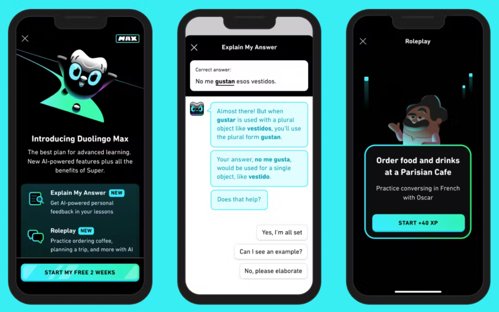

# 官网案例

AI 教育-Duolingo

作者：@Talia

## 产品介绍
Duolingo 多邻国创立于美国匹兹堡，创始人是卡内基梅隆大学的计算机科学院系教授&博士生导师Luis Von Ahn，另一位是其学生 Manuel Blum。

Duolingo 于 2012 年推出，现已成为全球领先的免费移动学习平台，是世界上最受欢迎的语言学习方式，它使用游戏化让语言学习更有趣、更吸引人。该平台在全球拥有超过5亿用户，支持40多种语言，包括英语、日语、韩语、法语、粤语等大众语言，也包括威尔士语、纳瓦荷语等小语种和濒危语言。另外它还是 Google Play 和 Apple App Store 教育类别中收入最高的应用程序。

3月14日 Duolingo 与 openai 合作，在 super 版本之上加入2个新功能（Max版本）：在iOS操作系统上学习西班牙语和法语的英语用户提供由 GPT-4 支持的新功能——“角色扮演”和“解释我的答案”。

## 版本及费用
ios的MAX版本（有GPT4接入）可以去某宝看看，相对划算，但目前只支持英语学法语/西班牙语

中国可以免费使用14天super版本（没有GPT4）

本文主要讲该产品中AI两大功能。

## 应用场景

GPT4 在 duolingo 中应用目前是基于英语学习法语或西班牙语，用户可以与 AI “角色扮演”自由对话（每次对话都不相同），真正意义上全真模拟练习；

在“解释我的答案”功能中让用户告别一知半解，真正去挖掘自己错没错，错哪了。

### 1. 角色扮演
角色扮演允许用户在应用程序中与世界角色练习现实世界的对话技巧。

系统将指导用户学习不同的场景下的对话从而更好地学习这门语言！

用户能与 Lin 讨论未来的度假计划，在巴黎的咖啡馆点咖啡，与 Eddy 一起去购买家具，或请朋友去徒步旅行。

虽然学习用户上并没有与真人交谈，但此功能背后的人工智能具有响应性和互动性，这意味着没有两个对话是完全相同的！互动后，用户获得人工智能反馈，了解他们回复的准确性和复杂性，以及未来对话的提示。

### 2. 解释我的答案
用户在学习过程中犯错，但不确定正确的答案是什么。

或者，一次又一次地犯同样的错误，也不明白为什么。

用户通过在练习类型后点击“解释我的答案”，可以与Duo的聊天，让用户更清楚自己是不是错了，错哪里了。

## 产品优势
1. 可以用各种语言与ChatGPT4系统对话，并收到关于他们发音和语法的反馈，来帮助用户练习口语和听力技能。
2. 作为通用语言AI模型它的回答非常灵活，很容易地适应广泛的用例，可以在各种语言场景中使用。
3. 在语言学习方面，它提供了高度个性化的学习体验，适应每个用户的需求和喜好。提供即时反馈，帮助用户纠正错误并提高语言学习能力。
4. chatgpt4已经在大量文本数据上进行了训练，使其能够识别其他模型可能错过的语言模式和结构，它能够准确地模拟人类语言，做好角色扮演。
5. 作为一个聊天机器人，它能够对用户查询提供即时响应、全天候可用性以及同时处理大量请求的能力。

## 推荐阅读
- 官网：https://investors.duolingo.com/
- 官网 Duolingo Max 介绍：https://blog.duolingo.com/duolingo-max/
- 官方 Duolingo Max 视频介绍 https://youtu.be/F-oLLqILsAU
- 《万字长文拆解 Duolingo 不收一分钱，从 0 到 30 亿美金的成长路径和学习设计理念：https://mp.weixin.qq.com/s/AWleFmILtj7i9xrsk2ORZA