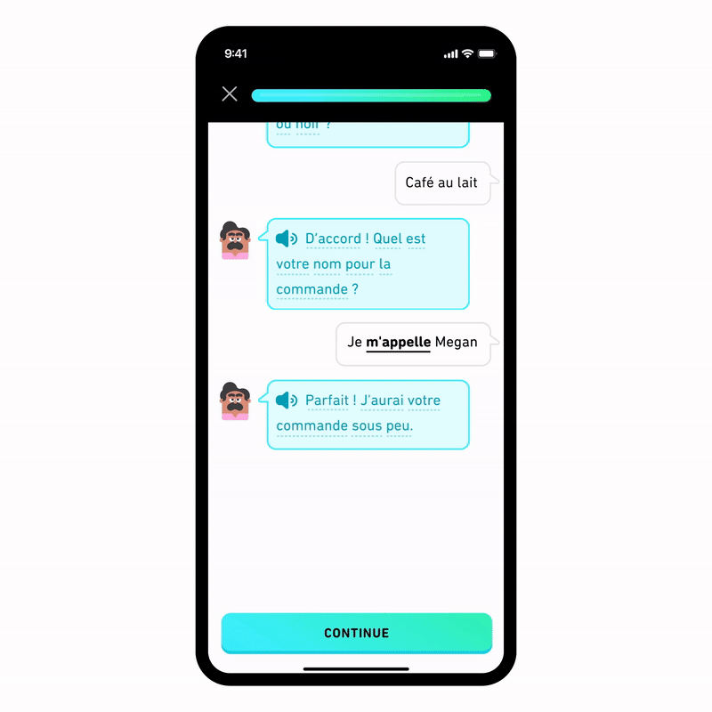
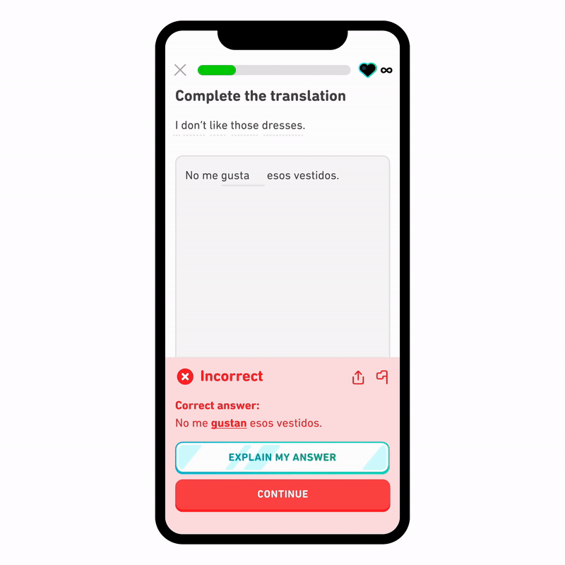

# 4.1.1 官网案例

# 1. AI 教育-Duolingo

作者：@Talia

## 产品介绍
Duolingo 多邻国创立于美国匹兹堡，创始人是卡内基梅隆大学的计算机科学院系教授&博士生导师Luis Von Ahn，另一位是其学生 Manuel Blum。

Duolingo 于 2012 年推出，现已成为全球领先的免费移动学习平台，是世界上最受欢迎的语言学习方式，它使用游戏化让语言学习更有趣、更吸引人。该平台在全球拥有超过5亿用户，支持40多种语言，包括英语、日语、韩语、法语、粤语等大众语言，也包括威尔士语、纳瓦荷语等小语种和濒危语言。另外它还是 Google Play 和 Apple App Store 教育类别中收入最高的应用程序。

3月14日 Duolingo 与 openai 合作，在 super 版本之上加入2个新功能（Max版本）：在 iOS 操作系统上学习西班牙语和法语的英语用户提供由 GPT-4 支持的新功能——“角色扮演”和“解释我的答案”。

## 版本及费用
ios的MAX版本（有GPT4接入）可以去某宝看看，相对划算，但目前只支持英语学法语/西班牙语

中国可以免费使用 14 天 super 版本（没有 GPT4）

本文主要讲该产品中 AI 两大功能。

## 应用场景

GPT4 在 duolingo 中应用目前是基于英语学习法语或西班牙语，用户可以与 AI “角色扮演”自由对话（每次对话都不相同），真正意义上全真模拟练习；

在“解释我的答案”功能中让用户告别一知半解，真正去挖掘自己错没错，错哪了。

### 1. 角色扮演
角色扮演允许用户在应用程序中与世界角色练习现实世界的对话技巧。

系统将指导用户学习不同的场景下的对话从而更好地学习这门语言！

用户能与 Lin 讨论未来的度假计划，在巴黎的咖啡馆点咖啡，与 Eddy 一起去购买家具，或请朋友去徒步旅行。

虽然学习用户上并没有与真人交谈，但此功能背后的人工智能具有响应性和互动性，这意味着没有两个对话是完全相同的！互动后，用户获得人工智能反馈，了解他们回复的准确性和复杂性，以及未来对话的提示。

### 2. 解释我的答案
用户在学习过程中犯错，但不确定正确的答案是什么。

或者，一次又一次地犯同样的错误，也不明白为什么。

用户通过在练习类型后点击“解释我的答案”，可以与Duo的聊天，让用户更清楚自己是不是错了，错哪里了。

## 产品优势
1. 可以用各种语言与 GPT4 系统对话，并收到关于他们发音和语法的反馈，来帮助用户练习口语和听力技能。
2. 作为通用语言 AI 模型它的回答非常灵活，很容易地适应广泛的用例，可以在各种语言场景中使用。
3. 在语言学习方面，它提供了高度个性化的学习体验，适应每个用户的需求和喜好。提供即时反馈，帮助用户纠正错误并提高语言学习能力。
4. GPT4 已经在大量文本数据上进行了训练，使其能够识别其他模型可能错过的语言模式和结构，它能够准确地模拟人类语言，做好角色扮演。
5. 作为一个聊天机器人，它能够对用户查询提供即时响应、全天候可用性以及同时处理大量请求的能力。

## 推荐阅读
- 官网：https://investors.duolingo.com/
- 官网 Duolingo Max 介绍：https://blog.duolingo.com/duolingo-max/
- 官方 Duolingo Max 视频介绍 https://youtu.be/F-oLLqILsAU
- 《万字长文拆解 Duolingo 不收一分钱，从 0 到 30 亿美金的成长路径和学习设计理念：https://mp.weixin.qq.com/s/AWleFmILtj7i9xrsk2ORZA

# 2. Be My Eyes

AI 在我们的生活中的应用一直是许多激烈讨论的话题。然而，无论你站在哪一边，有些领域可以毫无争议地认为AI具有积极的影响。Be My Eyes 就是一个这样的例子。该应用程序旨在使视觉受损的人更容易获得世界的无障碍性。

Be My Eyes 表示，该技术将成为盲人和部分视障用户的强大新资源。

### Be My Eyes 如何使用 GPT-4？

Be My Eyes 是 GPT-4 中包含的图像功能的早期采用者。GPT-4 在应用程序中的角色是虚拟志愿者。该过程通过 GPT-4 的图像到文本生成器分析图像进行工作。这里的关键因素是上下文。GPT-4 引擎不仅分析图像内容，还分析图像的上下文。

Be My Eyes 引用的例子很好地说明了这个虚拟志愿者系统的工作原理。将冰箱内容照片发送给应用程序的用户不仅会被告知冰箱里有什么，还可以提供使用这些食材制作哪些菜谱和建议。它甚至会发送每道菜的详细制作说明。

Be My Eyes 虚拟志愿者正在进行 beta 测试，根据 [Be My Eyes](https://www.bemyeyes.com/blog/introducing-be-my-eyes-virtual-volunteer) 博客的说法，该公司希望很快将其推向公众。它将在 Android 和 iOS 平台上免费提供给所有盲人和低视力会员使用。

# 3.可汗学院

在谈到有价值的事业时，另一个早期采用GPT-4的组织是可汗学院(Khan Academy)，这是一个[免费的在线课程平台](https://www.khanacademy.org/signup)。这个非营利组织的使命是向任何人提供免费的世界级教育。

正如 "Be My Eyes" 打算将 GPT-4 用作虚拟志愿者一样，可汗学院将 GPT-4 视为虚拟教师。该应用程序的推出是有限的，教学助手（称为 Khanmigo）仅对有限数量的用户可用。但是，有一个可汗学院等候名单，供那些想要帮助测试产品的人参加。成功的申请者被要求每月捐赠 20 美元。

### 可汗学院如何使用GPT-4?

可汗学院迅速指出，这个工具不会给学生答案。相反，它旨在使用 AI 引导学生走向正确的答案，GPT-4 会引导他们完成。

可汗学院打算将 GPT-4 用作学习和教学辅助工具。正在测试的一些用途包括:

**对于学生:**

- 考试准备
- 与 Khanmigo 合作编写故事
- 访问历史人物(可汗学院提到 Cleopatra 和 Jane Austen 作为例子)
- 改善和练习词汇技能

**对于教师:**

- 帮助管理任务
- 协助编写课程计划和创建课程引子
- 编写离校证明

可汗学院应用程序在所有平台上都是免费的；学生和教师可以在线注册加入[可汗学院](https://www.khanacademy.org/signup)。

# 4. Stripe

Stripe是一款支付处理平台，可以让各种类型的企业在线接收和发送付款，并提供其他业务管理工具。

OpenAI——GPT-4 大脑背后的大脑——已经与 Stripe 合作，该支付处理公司负责 OpenAI 的 DALL▪E 和 ChatGPT Plus 模型的支付系统。

现在，Stripe 正在将 GPT-4 集成到其平台中。该公司已经在简单任务中使用了 GPT-3，但集成 GPT-4 意味着 AI 将在公司的流程中发挥更大的作用。

### Stripe打算如何使用GPT-4

目前，GPT-4 将发挥的作用的细节尚不明确。但是，Stripe 已经考虑了 50 个潜在的用途，其中 15 个是足够强的候选人。

该公司表示，他们打算使用GPT-4来简化“用户体验”，并增加另一层欺诈检测。后一种情况使用 GPT-4 实时分析大量数据，并检测可能表明欺诈的语言和情感模式。

这对用户有利，但可以视为技术的隐藏使用。

从用户的角度来看，Stripe 表示，该软件可以给用户的业务提供惊人的见解水平。这帮助他们了解每个企业如何使用平台，并允许他们定制针对最终用户需求的支持资源。

开发人员表示，新系统将能够完全理解用户的问题。它还可以扫描支持文档并提供解决方案或在文档中突出显示相关文本。

