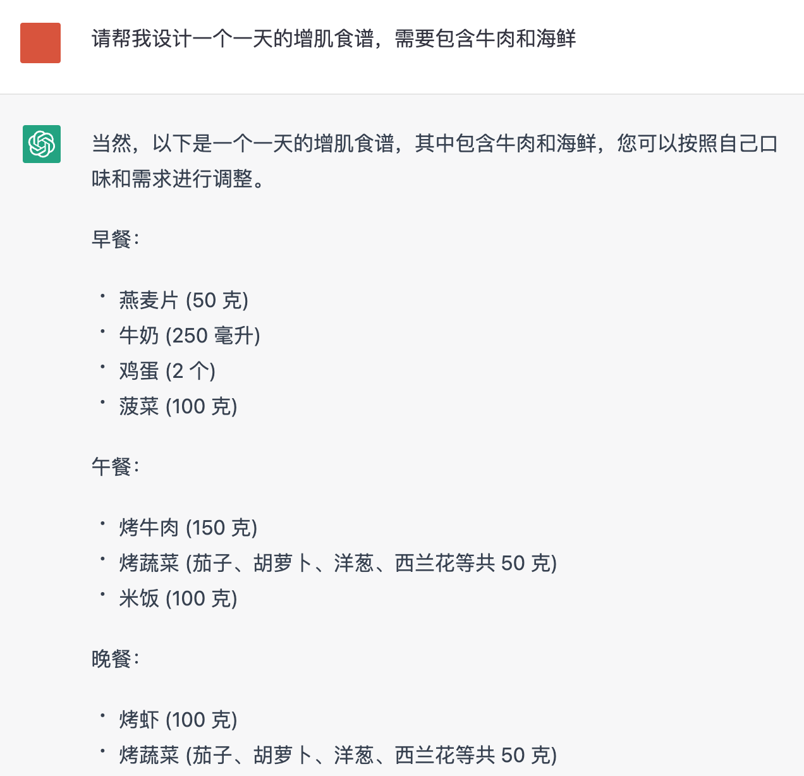

# 5.1. Prompt 工程

## 入门概念

**Prompt 和 Prompt Engineering 是什么？**

* Prompt是**给 AI 模型的指令**，它可以是一个问题、一段文字描述，甚至可以是带有一堆参数的文字描述。AI 模型会基于 prompt 所提供的信息，生成对应的文本，亦或者图片。
* 比如，我们在 ChatGPT 里输入 `What is the capital of China?` (中国的首都是什么？)，这个问题就是 prompt。
* 目前的 AI 产品还比较早期，因为各种原因，产品设置了很多限制，如果你想要绕过一些限制，或者更好地发挥 AI 的能力，也需要用到 Prompt Engineering 技术。

**在哪里输入 Prompt？**

我们默认此处讨论的是在 ChatGPT 等 Chatbot 类产品中使用 Prompt，那么，你只需要在产品的「聊天」输入框中输入指令即可，这个指令被称作「Prompt」，例如下图中我们关于食谱的问题：



## 基本原则

在撰写 Prompt 时，我们可以参考 Elavis Saravia 总结的优质 prompt 需包含的元素：

- **Instruction（必须）**： 指令，即你希望模型执行的具体任务。
- **Context（选填）**： 背景信息，或者说是上下文信息，这可以引导模型做出更好的反应。
- **Input Data（选填）**： 输入数据，告知模型需要处理的数据。
- **Output Indicator（选填）**： 输出指示器，告知模型我们要输出的类型或格式。
只要你按照这个框架写 prompt ，模型返回的结果都不会差。

并非每个元素都一定需要被包含，需要根据自己手头的任务进行取舍和调整。

以一个优质的 Prompt 为例：

```jsx

我想让你做一个 AI 写作导师。你的任务是使用人工智能工具（例如自然语言处理）向学生提供有关如何改进其作文的反馈。你还应该利用你在有效写作技巧方面的修辞知识和经验来建议学生可以更好地以书面形式表达他们的想法和想法的方法。//Context 背景信息
请以要点加上举例的格式回答。//输出指示
我的第一个请求是“请帮我修改下面这段文字：XXXXXXXXXXX”。//指令和输入

```

详情请阅读 [5.1.1. Prompt 基础](./Chain-of-Thought%20Prompting)

## 进阶技巧

**链式思考（Chain-of-Thought Prompting）是什么？**

Chain of thought prompting 是一种简单且广泛适用的方法，可提高大语言模型执行各种推理任务的能力。通过对算术和常识推理的实验，我们发现思维链式启发是模型规模的一种新兴属性。利用这种 Prompt 的方式，可以让你的大语言模型拥有更强的推理能力。

详情请阅读 [5.1.1. Chain-of-Thought Prompting](./Chain-of-Thought%20Prompting)


参考阅读：
[https://www.promptingguide.ai/zh](https://www.promptingguide.ai/zh)
[https://learningprompt.wiki/](https://learningprompt.wiki/)
