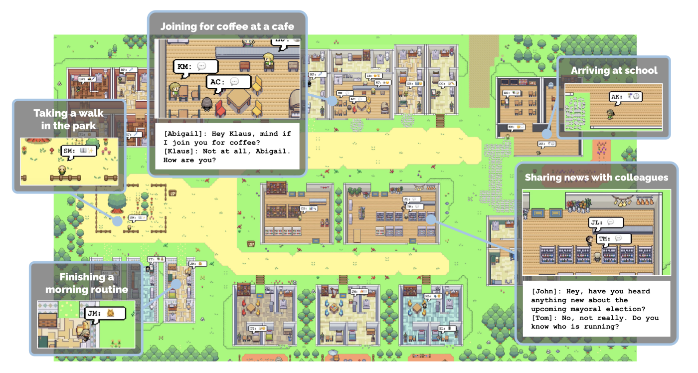

# 【麻瓜读论文】斯坦福用ChatGPT造了25个NPC模拟人生

> 麻瓜读论文系列是由闪闪团队出品的系列文章，旨在帮助非机器学习等“深奥”计算机科学研究者更好地理解 GPT，会详细解读最新的 GPT 相关的重要论文。
> 
> 
> 这里不会过多地关注技术/算法/数学细节，而是更多地关注「发生了什么」、「怎么做到的」、「可能的影响」等。
> 
> 如果你对于该系列文章有好的想法、建议，或者你也想要投稿，可以关注公众号「闪闪 SparkAI」。
> 



# 论文信息

论文链接：

[https://arxiv.org/abs/2304.03442](https://arxiv.org/abs/2304.03442)

论文基本信息：

- 标题：生成代理：人类行为的交互模拟
- 作者：[Joon Sung Park](https://arxiv.org/search/cs?searchtype=author&query=Park%2C+J+S), [Joseph C. O'Brien](https://arxiv.org/search/cs?searchtype=author&query=O%27Brien%2C+J+C), [Carrie J. Cai](https://arxiv.org/search/cs?searchtype=author&query=Cai%2C+C+J), [Meredith Ringel Morris](https://arxiv.org/search/cs?searchtype=author&query=Morris%2C+M+R), [Percy Liang](https://arxiv.org/search/cs?searchtype=author&query=Liang%2C+P), [Michael S. Bernstein](https://arxiv.org/search/cs?searchtype=author&query=Bernstein%2C+M+S)
- 摘要：
    
    > 可信的人类行为代理可以赋予互动应用程序强大的能力，从沉浸式环境到人际交流排练空间再到原型工具。在本文中，我们介绍了生成代理——计算机软件代理，模拟可信的人类行为。生成代理起床，煮早餐，然后去上班；艺术家绘画，作家写作；他们形成观点，互相注意，发起对话；他们回忆和反思过去的日子，计划下一天。为了实现生成代理，我们描述了一种架构，它扩展了一个大型语言模型，使用自然语言存储代理的完整记录，随着时间的推移将这些记忆综合成更高级别的反思，并动态检索它们以规划行为。我们实例化生成代理以填充受《模拟人生》启发的交互沙盒环境，最终用户可以使用自然语言与二十五个代理的小镇互动。在评估中，这些生成代理产生可信的个体和紧急社会行为：例如，只有一个用户指定的想法，即一个代理想要举办情人节派对，代理在接下来的两天内自主传播派对邀请，结交新朋友，互相邀请参加派对并协调好时间一起出现在派对上。通过削减实验证明了我们代理架构的组件——观察、计划和反思——对代理行为的可信度都做出了重要贡献。通过将大型语言模型与计算机交互代理融合，这项工作介绍了为实现可信的人类行为模拟的架构和交互模式。
    > 

# 麻瓜解读

## 发生甚摸事了？

放任25个AI共同生活，他们竟然模拟起了人类的行动！

不仅像人一样起床、刷牙、吃饭、睡觉，还会被迫“出门打工”，甚至在闲暇时分一起庆祝节日。

这一切，来自斯坦福和谷歌的一项新研究——

他们做了一个很新的实验，创造了25个AI NPC，每个NPC都有不同的身份和行动决策，并让它们在一个沙盒环境中共同生活，背后依靠**ChatGPT**大模型来完成行动决策。

结果发现，这些AI NPC不仅会像人一样生活，如作家就去写作、店主就去经营商店，而且他们彼此之间还会发生交互，甚至产生对话：

## 怎么做的（论文速读）

### 1. 生成式代理（Generative Agent）与效果

在论文作者们经过少量的试验之后，认为 ChatGPT 是可以模拟人类的行为的，并将模拟人类的机器人称为「生成式代理」（后文为方便直接称它们为 NPC）。

这些 NPC 可以自发地去做比如上班、上学、睡觉之类的事情，并且能够与环境里的其他物品发生交互，比如洗衣服、冲咖啡之类的，甚至可以与其他 NPC 用英文交流，更离谱的是在与其它的 NPC 发生交互之后，它们顺利地进行起了交朋友、搞暧昧、聚众搞 party 等事情。

在论文中描述了几种不是预编程、而是 Emergent 出来的社会行为：

- 传八卦

在论文中描述了这样一个例子，有一个叫 Sam 的老哥，在杂货店买东西的时候跟 Tom 聊说自己准备竞选市长，然后 Sam 走了之后有一个叫 John 的人，他也从其他地方听说了 Sam 准备竞选市长，然后在杂货店这俩人就对于 Sam 准备去竞选市长这事情聊了起来，包括他的获胜可能性啊、竞争对手什么的。


就这样，Sam 要去竞选市长这事情就传遍了整个镇子，每个人都在聊这事情。

- 关系记忆

玩过 RPG 类型游戏的朋友应该都知道，大部分 NPC 是纯粹的工具人，除非是预编程好的剧情，其他时候即使你曾经是他的救命恩人，你和他在街上遇见他也会懒得鸟你。


但是在这个模拟中，有俩人第一次在街上初次认识的时候，其中一人提及自己正在进行一个摄影项目，在之后两人再次相遇，和正常人一样，另一人开场的话题便是「你那个摄影项目进行的怎么样了呀？」

- 搞事情

这个也很厉害，以前都没办法想象一个机器人能做到这样。


有一个叫做 Isabella 的 NPC，在被设定一个 2 月 14 号下午搞一个情人节 Party 的初始意图之后，就开始自主地邀请她的朋友们，朋友们也邀请了他们的朋友，并且 Isabella 在 13 号就开始布置起了咖啡厅，最后 2 月 14 号的情人节 party 也顺利地举办了。

### 2. 生成式代理的架构

论文中的生成式是基于 ChatGPT （gpt-turbo-3.5 接口）构建出来的，那么显而易见地，我们可以想到拿 ChatGPT 模拟真实的人类的最大问题，就是Token 限制。

GPT 是没有长期记忆的，每次给它下指令的时候都需要把所有的信息给它，但对话的总 Token 数是 4096 个，而人类在行动的时候会有非常复杂的动机，可能因为自己的个性、也可能因为今天的心情、也有可能是对于他人的判断。

来看看这篇论文是怎么解决这个问题的，笔者将论文中构建生成式代理的方法总结为四个部分：

#### 人物设定

这是在创建时对于某个智能体的设置，例如对于 John Lin 有如下描述：

```jsx
John Lin是Willow市场和药店的药店老板，喜欢帮助人们。他总是在寻找让顾客获得药品更容易的方法；John Lin和妻子Mei Lin生活在一起，Mei Lin是一位大学教授，儿子Eddy Lin正在学习音乐理论；John Lin非常爱他的家人；John Lin已经认识隔壁老夫妇Sam Moore和Jennifer Moore几年了；John Lin认为Sam Moore是一个友善、好心的人；John Lin很了解他的邻居Yuriko Yamamoto；John Lin知道他的邻居Tamara Taylor和Carmen Ortiz，但以前没有见过他们；John Lin和Tom Moreno是Willows市场和药店的同事；John Lin和Tom Moreno是朋友，喜欢一起讨论当地政治；John Lin对Moreno家庭有一定的了解——丈夫Tom Moreno和妻子Jane Moreno。
```

#### 流水记忆

> 创建可以模拟人类行为的生成代理需要推理一组经验，其规模远大于应在提示中描述的内容，因为完整的记忆流可能会分散模型的注意力，而且目前甚至不适合于有限的上下文窗口。
> 

比如说，当问一个正常的人类「今天过的怎么样」的时候，他不会把今天干了的所有事情都回忆一遍并概括出来回答这个问题，如果需要 ChatGPT 模拟人类也同样不能将最近发生的所有事情传给它，概括内容来回答这个问题就变的不像人类了，论文在这里使用了一种记忆流的方法：


对于每发生的一件事情，都用流水账的方式记录下来，然后在每做下一步决策的时候对流水账里的每一项进行三种参数的评估和检索：

- Recency：这件事发生的时间有多近，越近发生的事情赋予 Recency 越高的值；
- Importance：这件事对该 NPC 来说有多重要，重要性由 NPC 自己来判断，1 最普通，10 最重要，比如某个 NPC 就会判断「整理房间」是 2，而「与喜欢的人约会」则是 8；
- Relevance：这件事与当下该 NPC 所处的环境有多相关。会拿当下遇到的任务文本与流水账里的文本进行向量匹配，比如当下是在和同学讨论作业，那么关于老师、课程的记忆文本就会匹配度较高，而早餐吃了什么匹配度就会比较低；

在将流水账中每一项的三种参数量化出来并相加之后，再排序从中选出最会被回忆起的那些记忆项，作为 Prompt 传递给 GPT，这时候 NPC 就能根据这些信息来做下一步的行动了。

#### 深刻反思

考虑这样一个场景：问一个正常人：“如果你只能选择一个认识的人一起度过一个小时，你会选择谁？”

对于正常人来说，可能会选暗恋的对象、自己的 Idol、或者崇敬的学者之类的，但如果在只有流水记忆的情况下，NPC 只会选择最近有过最频繁互动的人。如果按照这个逻辑，你很有可能会选天天在你面前 CPU 你的老板。如果是这样，那说明这个逻辑不正常、你也不正常。

于是论文引入第二种记忆类型，称为反思。反思是由代理生成的更高层次、更抽象的思想。

同样的，这个反思也是直接扔给 ChatGPT：

```jsx
关于Klaus Mueller的陈述

1. Klaus Mueller正在写一篇研究论文
2. Klaus Mueller喜欢阅读一本关于新兴区的书
3. Klaus Mueller正在与Ayesha Khan谈论锻炼[...]

你可以从上述陈述中推断出哪5个高层次见解？
```

然后根据 ChatGPT 的回答生成一个树状结构的反思，越高层的反思越抽象越概括：


因为它们是一种记忆，所以在检索时它们与其他观察结果一起被包括在内。反思定期生成，大约每天每个 NPC 会反思两到三次。

#### 规划并更新

到这里，由过去发生的事情已经可以驱使 NPC 去干看起来合理的事情了，但是，大部分正常人类的行为还会有一个相对长期的规划作为顶层驱使。例如你还有一个星期就要期末考试了，于是每天你可能都会规划去复习，而不是因为你的流水账里记载的都是打牌和打游戏你就继续玩游戏。

所以，在每一天开始时，作者们会让 NPC 们先做一个一天的大致规划，NPC 们每天也会跟着大致规划行事。

## 可能造成的影响

有了这几个组件之后，25 个 NPC在这个小镇中被模拟生活了两天的时间，也产生了许多的交互和事件。

尽管很多媒体报导了这件事情，小蓝鸟社交媒体上也有不少人讨论，大家也都在说一个西部世界在被构造出来：


但笔者认为可能这个事情成功的意义被远远低估了。

给 GPT 3.5 设定了合理的记忆模式和行为驱动因素后，在模拟过程中智能体们所表现出来的真实性意味着几个事情：

1. 助手式的人工智能，或者说 AGI 式的人工智能助手从技术实现上来说，也许真的很近了。

想象一下，你的人工智能如果能够根据你每天的行为模拟你，那么很多琐碎的事情它都可以进行决策和辅助，比如应该几点钟叫醒你、什么时候该准备好咖啡、接下来的日程是什么，所有的普通人都可以拥有一个生活助理+私人秘书。这将会大大提高那些能够站在更高层面上的思考者的效率，而从另一面来说，如果你没办法做更深谋远虑的决策，你的工作和生活中的决策将会完全依赖于 AI，甚至被 AI 取代，社会中的马太效应可能会再一次被放大。

2. 人工智能体之间的互动可能可以取代人类之间的大部分互动。

我不知道，也许这个结论下的有点夸张了。但在实验中，人工智能体之间的互动给我留下了非常深刻的印象，我隐隐觉得，这次大变革会比我们想象中更夸张。

- 人工智能体的互动比人类的互动更有效率，人类需要开几个小时会来讨论的问题，在机器的运作下，可能只需要几十秒钟。
    
    想象一下，你我他每个人都有一个秘书，当我做好决策、或者要传递信息的时候，只需要跟秘书说一声，然后我的秘书就去和所有相关人的秘书开会去了，一分钟之后，所有人的秘书根据自己老板的性格、喜好协商出了一个最优方案，然后每个秘书再去汇报给你我他。甚至任何人对这个方案有不理解的地方，直接问自己的秘书，自己的秘书也会一一给你解答，而不需要任何一个人类花费时间参与。
    
    曾经那种「你迟到了一分钟，就浪费了全班同学六十分钟」的事情再也不会发生。
    
- 而且，人工智能体的互动是以自然语言的方式进行的，这意味着我们如果对于结果有不满意，可以往回追溯到底是哪一步出了问题，从而对整个过程进行优化，不会对 AI 的决策过程失去控制。

对此我只能说，社恐福音。

3. AI 所属权、伦理、安全等等等等问题迫在眉睫

如果在可预见的时间里，AI 越来越强，甚至不需要一个试图毁灭世界的二五仔 AI 出现，伪造数据、对于 AI 过分依赖、AI 霸权加剧阶级分化等等问题直接就可以让普通人们当场暴毙。

# 论文正文中译

## 摘要

可信的人类行为代理可以为互动应用程序提供动力，从沉浸式环境到人际交往排练空间到原型工具。在本文中，我们介绍生成代理 - 模拟可信人类行为的计算软件代理。生成代理会醒来，做早餐，然后去工作；艺术家绘画，作家写作；他们形成观点，注意彼此，并发起对话；他们回忆过去的日子并计划未来的日子。为了实现生成代理，我们描述了一种体系结构，它扩展了大型语言模型以使用自然语言存储代理的完整记录，随着时间的推移将这些记忆综合成更高级别的反思，并动态检索它们以规划行为。我们实例化生成代理，以填充受《模拟人生》启发的互动沙盒环境，最终用户可以使用自然语言与25个代理的小镇互动。在评估中，这些生成代理产生可信的个体和紧急社交行为：例如，仅从一个用户指定的概念开始，即一个代理想要举办情人节派对，代理在接下来的两天自主地传播派对邀请，结交新朋友，邀请对方参加派对，并协调在正确的时间一起出现在派对上。我们通过消融证明，我们代理体系结构的组件 - 观察，规划和反思 - 每个都对代理行为的可信度做出了至关重要的贡献。通过将大型语言模型与计算，交互代理融合，这项工作介绍了启用可信人类行为模拟的架构和交互模式。

## 介绍

我们如何创建一个反映可信人类行为的交互式人工社会？从《模拟人生》这样的沙盒游戏到认知模型[21]和虚拟环境[9, 58]等应用，研究人员和实践者已经设想了计算代理人，可以作为可信的人类行为代理。在这些愿景中，计算机代理人根据他们的过去经验行事，并对其环境做出可信的反应。这种人类行为的模拟可以用逼真的社会现象填充虚拟空间和社区[26, 79]，培训人们如何处理罕见而困难的人际关系[43, 51, 93]，测试社会科学理论[11, 45]，创建用于理论和可用性测试的模型人类处理器[21, 38, 50]，为普适计算应用[30]和社交机器人[9, 13]提供动力，并支撑在开放世界中导航复杂人际关系的不可玩游戏角色[58, 84]。
然而，人类行为的空间是广阔而复杂的[84, 108]。尽管在大型语言模型[17]方面取得了惊人的进展，可以在单个时间点上模拟可信人类行为[38, 79]，但是确保长期一致性的完全通用代理人更适合管理不断增长的记忆，随着时间的推移，处理在多个代理人之间展开的级联社会动态。成功需要一种方法，可以在长时间内检索相关事件和互动，反思这些记忆以进行概括和绘制更高层次的推论，并应用该推理来创建计划和反应，既在当下有意义，又在代理人行为的长期轨迹中有意义。

在本文中，我们介绍了生成式代理（generative agents）——利用生成模型模拟可信人类行为的代理，并证明它们能够产生具有信服力的个体和群体行为的模拟。

生成式代理对自己、其他代理和环境进行各种推理，制定反映其特征和经验的日常计划，执行这些计划，在适当时候做出回应和重新制定计划。例如，当他们看到早餐烧焦时，生成式代理会关闭炉子，如果浴室已被占用，他们会在外面等待，当他们遇到想要聊天的其他代理时，会停下来聊天。一个充满生成式代理的社会具有新关系的形成、信息的扩散和代理之间的协调等新兴社会动态。

为了实现生成式代理，我们描述了一个代理架构，该架构使用大型语言模型存储、合成和应用相关记忆，生成可信的行为。我们的架构由三个主要组件组成：

- 第一个是记忆流，一个长期记忆模块，以自然语言记录代理的经历的全面列表。检索模型将相关性、新近度和重要性结合起来，以呈现需要了解的记录，以指导代理的时刻行为。
- 第二个是反思，它将记忆合成为高级别推理，使代理能够得出关于自身和其他人的结论，以更好地指导其行为。
- 第三个是规划，它将这些结论和当前环境转化为高级别的行动计划，然后递归地转化为具体的行动和反应。这些反思和计划被反馈到记忆流中，以影响代理的未来行为。

这种架构提供了在多个领域中应用的可能性，从角色扮演和社交原型到虚拟世界和游戏。在社交角色扮演场景（例如，面试准备）中，用户可以安全地排练困难、充满冲突的对话。当原型化社交平台时，设计师可以超越临时角色，原型化随时间展开的动态、复杂的交互。本文的重点是创建一个受到《模拟人生》等游戏启发的小型互动智能体社区的能力。通过将我们的架构连接到ChatGPT大型语言模型[76]，我们在游戏环境中实现了一个由25个智能体组成的小型社区。最终用户可以观察和与这些智能体互动。例如，如果最终用户或开发人员希望该城镇举办一场游戏内情人节派对，传统的游戏环境需要手动编写数十个角色的脚本。我们证明，通过生成智能体，只需告诉一个代理人她想要举办一个派对即可。尽管存在许多潜在的故障点 - 派对策划者必须记得告诉其他代理人关于派对的事情，与会者必须记得邀请，那些记得的人必须决定是否真的出现，以及其他可能的故障点 - 我们环境中的代理人成功了。他们传播了关于派对的消息，然后出现了，甚至有一个代理人向另一个代理人邀请参加派对，所有这些都来自这个单一的用户生成的种子建议。

我们进行了两项生成式代理的评估：一项受控制的评估，以测试代理在隔离中是否产生可信的个体行为，以及一项端到端的评估，在两天的游戏时间内生成式代理以开放式的方式相互交互，以了解它们的稳定性和紧急社会行为。在技术评估中，我们利用一种方法论上的机会，通过自然语言对它们进行“访问”来评估代理的知识和行为，以探索代理准确地留在角色中、记住、规划、反应和反思的能力。我们比较了几种限制代理访问记忆、反思和计划的消融方法。我们观察到，这些组件对代理行为的强大表现都做出了重要贡献。在技术和端到端的评估中，最常见的错误是代理无法检索到相关的记忆，对代理的记忆添加了虚构的装饰，或者从语言模型继承了过于正式的语言或行为。

总之，本文提供了以下贡献：

- 生成式代理，可信人类行为的逼真模拟，其动态条件化于代理的不断变化的经验和环境。
- 一种新颖的架构，使生成式代理能够通过动态演变的情况记忆、检索、反思、与其他代理互动和规划。该架构利用了大型语言模型的强大提示功能，并补充了这些功能以支持更长期的代理一致性、管理动态演变的记忆，并递归地产生更多的代理一代。
- 两项评估（受控制的评估和端到端的评估），以建立架构组件的重要性的因果关系，并确定由于错误的记忆检索等原因而导致的问题。
- 讨论生成式代理在交互系统中的机会、伦理和社会风险。我们认为，这些代理应该调整以减轻用户形成寄生社交关系的风险，记录以减轻来源于深度伪造和定制说服的风险，并以补充而不是替代设计过程中的人类利益相关者的方式应用。

## 2 相关工作

在本节中，我们回顾了人工智能与人类交互的先前文献，并将建立可信的人类行为代理的议程置于其经典之中。这个议程曾经被认为是交互、游戏和人工智能社区的北极星[9, 58, 84, 85]，但由于人类行为的复杂性[16, 108]，它一直难以实现。我们综合这项研究，建议在使用适当的架构的情况下，大型语言模型虽然不能单独满足要求，但可以开辟创建可信代理的新方向。

### 2.1 人工智能与人类交互

交互式人工智能系统旨在将人类洞察力和能力结合到计算工件中，以增强其用户[3, 29]。长期以来，有许多工作探索了允许用户交互指定模型行为的方法。例如，Crayons演示了交互式机器学习的早期愿景，允许非专家用户训练分类器[29]。进一步的工作帮助阐述了最终用户如何通过示例[33]和/或演示[31]来描述系统的分类目标。最近的工作将这些探索扩展到深度学习[62]和基于提示的创作[49, 66, 106]。

同时，一个持久的研究线程推进了语言和基于代理的人机交互。SHRDLU[103]和ELIZA[102]等形成性工作演示了与计算系统进行自然语言交互的机会和风险。随着研究的进展，变得清晰的是，自主代理可以提供新的委托和交互隐喻[67]，但人类和代理之间的委托线路仍在被辩论和完善[46, 88, 89]。最近，这项技术已经足够稳定，使得代理可以通过自然语言在大型和复杂的在线社交环境中进行交互（例如[54]）。自然语言交互提供了一种新的模态，可以扩展用户在诸如照片编辑[2, 34, 64]和代码编辑[87]等领域的能力。

我们召集这些工作线程，以表明我们现在可以创建代理，代理人类行为，用自然语言与它们交互。在这样做的过程中，这项工作重新打开了考虑基本人机交互问题的大门，例如GOMS和KLM等认知模型[21, 22]，原型工具[79]和普适计算应用程序[25, 30, 100]。

### 2.2 可信的人类行为代理

先前的文献已经描述了可信度或可信代理作为中心设计和工程目标。可信代理被设计为提供生命的幻觉，并以它们似乎自主做出决策和行动的方式呈现出现实主义的外观，类似于迪斯尼电影中的角色[9, 95]。这些代理可以像我们所居住的那样在开放世界环境中存在和感知[9, 58]，并努力表现出在与用户或其他代理的社交互动中体现的新兴行为，以成为我们在个人和社区的假设模拟中可信的代理[19, 35, 70]。历史上，这些代理是在智能游戏NPC[58, 84]的背景下开发的。如果可能，创建具有可信行为的NPC可以通过启用新兴叙述[7, 15, 48, 92]和与代理人的社交互动来增强游戏和交互小说中的玩家体验。然而，更重要的是，游戏世界提供了越来越现实的现实世界的展示，并且正如Laird和van Lent在2001年所观察到的那样，这些模拟世界为可信代理的开发人员提供了可访问的实验室，以调整代理的认知能力，而不必担心在现实世界中实施机器人技术或从头开始创建模拟环境[58, 84]。

在过去的四十年中，出现了多种创造可信代理的方法。然而，在实现过程中，这些方法经常简化环境或代理行为维度，以使努力更易管理[16，72]。基于规则的方法，如有限状态机[90，96]和行为树[40，53，81]，解决了人类编写代理行为的暴力方法[70]。它们提供了一种创建简单代理的简单方法，至今仍是最主要的方法[68，73，109]，甚至可以处理基本的社会互动，如模拟游戏《质量效应》[12]和《模拟人生》[6]系列。然而，手工制作的行为无法全面地解决开放世界中可能的互动范围，这意味着得到的代理行为可能无法完全代表其互动的后果[69-71]，并且不能执行未在其脚本中硬编码的新程序[90，96]。另一方面，用于创建可信代理的流行基于学习的方法，例如强化学习，通过让代理学习其行为来克服手动编写的挑战，并在最近的游戏中取得了超人类表现，例如《星际争霸》的AlphaStar [98]和Dota 2的OpenAI Five [10]。然而，它们的成功主要发生在具有易于定义奖励的对抗性游戏中，学习算法可以进行优化。它们尚未解决在开放世界中创建可信代理的挑战[39，73，90]。

计算认知体系结构是由Newell开创的，旨在构建支持全面认知功能的基础设施[75]，适合其最初愿景中可信代理的全面性质。它们推动了一些最早的可信代理示例。例如，Quakebot-SOAR [59]和ICARUS [24，63]生成了第一人称射击游戏中的NPC，而TacAir-SOAR [80]在空战训练模拟中生成了飞行员。这些代理使用的架构不同（Quakebot和TacAir-SOAR依赖于SOAR [60]，而ICARUS则依赖于其自己的变体，受SOAR和ACT-R [5]的启发），但它们共享相同的基本原理[61]。它们维护短期和长期记忆，用符号结构填充这些记忆，并在感知-计划-行动循环中运转，动态感知环境并将其与手动制作的行动程序之一匹配[57，96]。使用认知体系结构创建的代理旨在适用于大多数，如果不是所有开放世界环境，并展示其时间的强大行为。然而，它们的行动空间仅限于手动制作的程序性知识，并且它们没有提供一种机制，通过该机制代理可以被启发去寻求新的行为。因此，这些代理主要部署在非开放世界环境中，例如第一人称射击游戏[24，59]或块世界[63]。

今天，如其最初的定义所描述的那样创建可信代理仍然是一个开放的问题[84，108]。许多人已经移动到其他地方，认为尽管为创建可信代理而存在的现有方法可能很麻烦并且有限，但它们足以支持现有的游戏玩法和互动[23，74，108]。我们的论点是，大型语言模型提供了一个机会，可以重新审视这些问题，前提是我们可以设计出一种有效的架构，将记忆综合为可信的行为。我们在本文中提供了朝向这样的架构的一步。

### 2.3 大语言模型和人类行为

生成代理利用大型语言模型来驱动其行为。关键观察是，大型语言模型对其训练数据中表示的广泛的人类行为进行编码[14，17]。如果提示具有狭义的上下文，这些模型可以用于生成可信行为。最近的工作已经证明了这种方法的有效性。例如，Social Simulacra使用大型语言模型生成用户，这些用户将填充新的社交计算系统以原型化其新兴的社交动态[79]。这种方法使用提示链[105，106]生成个人和其行为的简短自然语言描述，因为它们出现在正在原型化的系统中。其他经验研究已经复制了现有的社会科学研究[45]，政治调查[91]和生成合成数据[38]。大型语言模型还用于生成用户进行互动人类行为。例如，在游戏中，这些模型已被用于创建交互式小说[36]和文本冒险游戏[20]。由于它们能够生成和分解动作序列，因此大型语言模型还用于规划机器人任务[47]。例如，当提出一个任务，例如拿起一个瓶子时，模型被提示将任务分解为较小的动作序列，例如前往瓶子所在的桌子并拿起它。

我们认为，基于上述工作，大型语言模型可以成为创建可信代理的关键因素。现有文献主要依赖于可以视为使用少量提示的一阶模板[37，65]或思维链提示[99]。这些模板有效地生成仅基于代理当前环境条件的行为（例如，巨魔如何回应给定的帖子，机器人需要采取哪些行动才能进入房间，假设有一扇门）。但是，可信代理需要不仅在当前环境上进行条件处理，而且还需要对大量过去的经验进行条件处理，这是使用一阶提示的不良适应（并且截至今天，由于基础模型的上下文窗口有限，不可能）。最近的研究尝试通过增加静态知识库和信息检索方案[52]或简单的摘要方案[104]来超越一阶提示。本文扩展这些想法，设计了一种代理架构，该架构在检索处理方面处理过去的经验，其中每个时间步骤都会动态更新，并将其与代理的当前上下文和计划混合在一起，这些计划可能会相互加强或矛盾。

## 3 生成智能体的行为和互动

为了具体说明生成智能体的可支持性，我们将它们实例化为简单的沙盒世界中的角色，类似于《模拟人生》[6]。这个基于精灵的沙盒游戏世界Smallville，唤起了一个小镇的环境。在本节中，我们将通过Smallville中的生成智能体的可支持性和互动，描述它们的行为。然后，在第4节中，我们介绍了支持这些可支持性和互动的生成智能体架构。在第5节中，我们描述了沙盒环境的实现方式以及智能体如何与沙盒世界的基础引擎互动。

### 3.1 智能体化身和通信


Smallville中居住着25个独特的智能体社区。每个智能体都由一个简单的精灵化身代表。我们为每个智能体撰写了一个自然语言描述，以描述他们的身份，包括他们的职业和与其他智能体的关系，作为种子记忆。

例如，John Lin有以下描述：

John Lin是Willow市场和药店的药店老板，喜欢帮助人们。他总是在寻找让顾客获得药品更容易的方法；John Lin和妻子Mei Lin生活在一起，Mei Lin是一位大学教授，儿子Eddy Lin正在学习音乐理论；John Lin非常爱他的家人；John Lin已经认识隔壁老夫妇Sam Moore和Jennifer Moore几年了；John Lin认为Sam Moore是一个友善、好心的人；John Lin很了解他的邻居Yuriko Yamamoto；John Lin知道他的邻居Tamara Taylor和Carmen Ortiz，但以前没有见过他们；John Lin和Tom Moreno是Willows市场和药店的同事；John Lin和Tom Moreno是朋友，喜欢一起讨论当地政治；John Lin对Moreno家庭有一定的了解——丈夫Tom Moreno和妻子Jane Moreno。

每个分号分隔的短语都作为记忆在模拟开始时输入到智能体的初始记忆中。

***3.1.1 智能体之间的通信。***智能体通过他们的行动与世界互动，并通过自然语言与彼此交流。在沙盒引擎的每个时间步骤中，智能体会输出一个自然语言声明，描述他们当前的行动，例如“Isabella Rodriguez正在写她的日记”，“Isabella Rodriguez正在查看她的电子邮件”，“Isabella Rodriguez正在和她的家人通电话”，或“Isabella Rodriguez正在准备睡觉”。然后，这个声明被转化为影响沙盒世界的具体动作。动作在沙盒界面上显示为一组表情符号，提供了从俯视视角抽象表示动作的方式。为了实现这一点，系统采用了一个语言模型，将动作翻译成一组表情符号，在一个话语气泡中出现在每个化身上面。例如，“Isabella Rodriguez正在写她的日记”显示为，而“Isabella Rodriguez正在查看她的电子邮件”出现为。单击代理化身可以访问动作的完整自然语言描述。

智能体之间使用完整的自然语言进行交流。智能体了解他们当地区域的其他智能体，并根据生成智能体的架构确定他们是否走过去或进行交谈。下面是Isabella Rodriguez和Tom Moreno之间关于即将到来的选举的对话的一个示例：

> Isabella: 我还在权衡利弊，但我一直在和Sam Moore讨论选举。你对他有什么看法？
> 
> 
> Tom: 老实说，我不喜欢Sam Moore。我认为他脱离了社区，没有我们的最佳利益在心中。
> 

***3.1.2 用户控制。***运行此模拟的用户可以通过对话与代理进行通信或通过向代理发布指令的形式进行干预“内部声音”。

用户通过自然语言与代理进行交流，指定代理应该将他们视为何种角色。例如，如果用户指定自己为新闻“记者”并询问即将到来的选举，“谁将参加选举？”，那么John代理会回答：

> John：我和我的朋友Yuriko、Tom一直在谈论即将到来的选举，并讨论候选人Sam Moore。我们都同意投票给他，因为我们喜欢他的计划。
> 

要直接命令其中一个代理，用户必须扮演代理的“内部声音”——这使得该代理更有可能将该语句视为指令。例如，当用户以John的内部声音告诉他：“你将在即将到来的选举中竞选对手是Sam”，John决定参加选举并与妻子和儿子分享他的候选资格。

### 3.2 环境交互

Smallville具有小村庄的常见特征，包括咖啡馆、酒吧、公园、学校、宿舍、房屋和商店。它还定义了使这些空间具有功能的子区域和对象，例如房子里的厨房和厨房里的炉子（图2）。所有作为代理主要居住处的空间都配有床、桌子、衣柜、架子、浴室和厨房3。

代理在Smallville中移动，就像在简单的视频游戏中一样，进入和离开建筑物，导航其地图，并接近其他代理。代理的移动由生成代理架构和沙盒游戏引擎指导：当模型规定代理将移动到一个位置时，我们会在Smallville环境中计算到达目的地的步行路径，然后代理开始移动。此外，用户还可以作为操作Smallville中代理的代理进入沙盒世界。用户所扮演的代理可以是已经存在于世界中的代理，例如Isabella和John，或者可以是没有先前历史的外部访问者。Smallville的居民不会区别对待用户控制的代理。他们会意识到其存在，发起互动，并在形成意见之前记住其行为。

用户和代理可以像在沙盒游戏（例如The Sims）中一样影响这个世界中对象的状态。例如，当代理睡觉时，床可以被占用，当代理用完材料做早餐时，冰箱可以为空。最终用户还可以通过自然语言重新塑造Smallville中代理的环境，改写代理周围物体的状态。例如，当Isabella早上在做早餐时，用户可以通过输入系统命令将厨房炉子的状态从“打开”改为“燃烧”，选择对象并说明其新状态，如下所示：`“<Isabella的公寓：厨房：炉子>正在燃烧”`。 Isabella会在下一刻注意到这一点并去关掉炉子并重新做早餐。同样，如果用户在Isabella进入浴室时将淋浴器的状态设置为“漏水”，她会从客厅取出工具来修理漏洞。

### 3.3 “小镇的一天”示例

从单一段落的描述开始，代理开始计划他们的一天。随着时间在沙盒世界中流逝，他们的行为会因为这些代理彼此之间和与世界互动，建立记忆和关系以及协调联合活动而演变发展。

我们通过追踪我们系统在代理John Lin的一天过程中的输出来展示生成代理的行为（图3）。在林家中，John是早上7点钟第一个起床的人。他刷牙，洗澡，穿衣服，吃早餐，并在客厅的餐桌上查看新闻。早上8点钟，Eddy跟着他的步伐，匆忙起床准备上课。他赶上John正要出门：

> John：早上好，Eddy。你睡得好吗？
Eddy：早上好，爸爸。是的，我睡得很好。
John：那很好。今天你在做什么？
Eddy：我正在为我的课程创作一首新的音乐作品。它这个星期就要交了，所以我正在努力完成它。但是我觉得很有趣！
John：听起来很棒啊！
Eddy离开后不久，Mei醒了过来并加入了John。Mei问起她的儿子，John回忆了他们刚刚的谈话：
Mei：Eddy已经去上学了吗？
John：是的，他刚刚离开。他正在为他的课程创作音乐。
Mei：哦，太好了！告诉我更多。
John：我觉得他真的很享受这个！他说他非常喜欢它。
Mei：太好了！我为他感到骄傲。
> 

当他们结束谈话时，Mei和John打包行李。Mei去教学和研究论文，而John在早上9点钟在Willow Market和Pharmacy开启了他的药房柜台。


### 3.4 出现的社会行为

通过彼此互动，Smallville中的生成代理交换信息，形成新的关系，并协调联合活动。扩展先前的工作[79]，这些社会行为是新兴出现的，而不是预编程的。

***3.4.1 信息扩散。***当代理注意到彼此时，它们可能会进行对话，因此信息可以从代理传播到代理。例如，在杂货店的Sam和Tom之间的对话中，Sam告诉Tom他参加了当地选举：

> Sam：嘿，Tom，怎么样？
Tom：好的，谢谢。有什么事吗？
Sam：嗯，我想和你谈谈。我实际上正在参加即将到来的当地选举，竞选市长。
Tom：真的吗？那太好了！你为什么要参加竞选？
Sam：我已经参与地方政治多年了，我真的觉得我可以在我们社区发挥作用。而且，我想带来新的想法和观点。
那天晚些时候，Sam离开后，Tom和John通过其他渠道听到了这个消息，讨论Sam赢得选举的机会：
John：我听说Sam Moore正在参加当地选举竞选市长。你认为他有很大的机会赢吗？
Tom：我认为他有很大的机会。他在社区里一直很努力，我认为他会得到很多支持。你觉得呢？
John：我认为他参选很好。我很好奇还有谁在参选以及选举结果会怎样。
> 

渐渐地，Sam的竞选成为镇上的话题，有些人支持他，而有些人则还没有决定。

***3.4.2 关系记忆。***Smallville中的代理随着时间的推移形成新的关系，并记住他们与其他代理的互动。例如，Sam起初不认识Latoya Williams。在Johnson Park散步时，Sam遇到了Latoya，并互相介绍。Latoya提到她正在进行一项摄影项目：“我在这里拍一些照片，为我正在进行的一个项目。”在后来的互动中，Sam与Latoya的互动表明他记得那次互动，因为他问“嗨，Latoya，你的项目进行得怎么样？”她回答：“嗨，Sam，进行得很好！”

***3.4.3 协调。***生成代理相互协调。Isabella Rodriguez在Hobbs Cafe中初始化一个意图，在2月14日的下午5点到7点之间计划情人节聚会。从这个种子开始，代理在Hobbs Cafe或其他地方看到朋友和客户时邀请他们参加。然后，Isabella在13日下午装饰咖啡馆。Maria是Isabella的常客和亲密的朋友，她来到了咖啡馆。Isabella请求Maria帮助她装饰聚会，而Maria同意了。Maria的角色描述提到，她喜欢Klaus。那天晚上，Maria邀请Klaus，她的暗恋对象，参加聚会，他很高兴地接受了。

在情人节那天，包括 Klaus 和 Maria 在内的五个代理商在下午5点到达 Hobbs Cafe 并享受节日活动（图4）。在这种情况下，终端用户只设置了 Isabella 的初始意图来举办派对和 Maria 对 Klaus 的爱慕之情：传播消息、装饰、互相约会、到达派对以及在派对上相互交流的社交行为是由代理架构启动的。

## 4 生成代理架构


生成代理旨在为开放世界中的行为提供框架：这个世界可以与其他代理进行交互，并能够对环境中的变化做出反应。生成代理将当前环境和过去的经验作为输入，并将行为生成为输出。在这种行为的背后是一种新型代理架构，它将大型语言模型与合成和检索相关信息的机制相结合，以在语言模型的输出上进行条件。如果没有这些机制，大型语言模型可以输出行为，但是由此产生的代理可能不会基于代理的过去经验作出反应，可能不会进行重要推理，也可能不会保持长期一致性。即使在今天的最佳模型（如 GPT-4）中，长期规划和一致性方面仍存在挑战 [18]。由于生成代理产生大量的事件和记忆流，必须保留这些流，因此我们架构的核心挑战之一是确保在需要时检索和合成代理记忆的最相关部分。

我们架构的中心是记忆流，它是一个数据库，维护代理的经验的全面记录。从记忆流中，记录被检索出来，以计划代理的动作并适当地对环境做出反应，并且记录被递归地合成成更高级别的观察结果，以指导行为。架构中的所有内容都记录和推理为自然语言描述，允许架构利用大型语言模型。

我们目前的实现使用了 GPT-3.5-turbo 版的 ChatGPT [76]。我们预计，生成代理的架构基础——记忆、规划和反思——在语言模型改进时可能仍然保持不变。新的语言模型（例如 GPT-4）将继续扩展支撑生成代理的提示的表现力和性能。然而，截至撰写本文时，GPT-4 的 API 仍然是仅限邀请的，因此我们的代理使用 ChatGPT。

### 4.1 记忆和检索

挑战：创建可以模拟人类行为的生成代理需要推理一组经验，其规模远大于应在提示中描述的内容，因为完整的记忆流可能会分散模型的注意力，而且目前甚至不适合于有限的上下文窗口。考虑 Isabella 代理回答“你最近对什么充满热情？”这个问题。将所有 Isabella 的经验概括到语言模型有限的上下文窗口中，会产生一个无意义的回答，其中 Isabella 讨论了诸如合作举办活动和项目、咖啡馆的清洁和组织等话题。而不是概括，下面描述的记忆流会呈现相关的记忆，从而产生更具信息量和具体的回答，提到 Isabella 对让人感到受欢迎和包容、策划活动、创造人们可以享受的氛围（如情人节派对）的热情。

方法：记忆流维护代理的经验的全面记录。它是一个内含自然语言描述、创建时间戳和最近访问时间戳的记忆对象列表。记忆流的最基本元素是观察，它是代理直接感知的事件。常见的观察包括代理自己执行的行为，或代理感知到其他代理或非代理对象正在执行的行为。例如，Isabella Rodriguez 在咖啡店工作，可能随着时间的推移积累以下观察结果：（1）Isabella Rodriguez 正在摆放糕点，（2）Maria Lopez 正在喝咖啡学习化学，（3）Isabella Rodriguez 和 Maria Lopez 正在谈论在 Hobbs Cafe 策划情人节派对，（4）冰箱是空的。


我们的架构实现了一个检索函数，它将代理的当前情况作为输入，并返回一个子集的内存流以传递给语言模型。检索函数有许多可能的实现，这取决于代理在决定如何行动时需要考虑什么。在我们的上下文中，我们专注于三个主要组件，共同产生有效的结果。

最近性将最近访问的内存对象分配更高的分数，以便一段时间前或今天早上的事件可能仍在代理的注意力范围内。在我们的实现中，我们将最近性视为指数衰减函数，其衰减因子为0.99，根据上次检索内存以来的沙盒游戏小时数。

重要性通过分配更高的分数来区分平凡的和核心记忆，这些记忆对象代理人认为很重要。例如，像在自己的房间里吃早餐这样的平凡事件会产生较低的重要性分数，而与重要人物分手则会产生较高的分数。关于重要性评分，也有许多可能的实现方法；我们发现直接询问语言模型输出整数评分是有效的。完整提示如下所示：

```jsx
在1到10的尺度上，其中1是纯粹平凡的（例如，刷牙，整理床铺），而10则是极其深刻的（例如，分手，大学录取），请评估以下记忆的可能性。

记忆：在柳树市场和药店购买杂货

评分：<填写>
```

此提示返回“整理房间”整数值为2，“向你的心仪对象约会”整数值为8。重要性评分是在创建内存对象时生成的。

相关性将与当前情况相关的内存对象分配更高的分数。相关性取决于“相关于什么？”，因此我们将相关性条件付诸于查询内存。例如，如果查询是学生在与同学讨论化学考试要学习什么，那么有关他们早餐的内存对象应具有较低的相关性，而关于老师和学校工作的内存对象应具有较高的相关性。在我们的实现中，我们使用语言模型生成每个内存的文本描述的嵌入向量。然后，我们计算相关性，即内存的嵌入向量与查询内存的嵌入向量之间的余弦相似度。

为了计算最终的检索分数，我们通过最小-最大缩放将最近性，相关性和重要性分数归一化为[0,1]范围。检索函数将所有内存作为三个元素的加权组合进行评分：𝑠𝑐𝑜𝑟𝑒 = 𝛼𝑟𝑒𝑐𝑒𝑛𝑐𝑦 · 𝑟𝑒𝑐𝑒𝑛𝑐𝑦 + 𝛼𝑖𝑚𝑝𝑜𝑟𝑡𝑎𝑛𝑐𝑒 ·𝑖𝑚𝑝𝑜𝑟𝑡𝑎𝑛𝑐𝑒 +𝛼𝑟𝑒𝑙𝑒𝑣𝑎𝑛𝑐𝑒 ·𝑟𝑒𝑙𝑒𝑣𝑎𝑛𝑐𝑒。在我们的实现中，所有𝛼均设置为1。然后将适合语言模型上下文窗口的排名靠前的内存包含在提示中。

### 4.2 反思

挑战：当产生代理只配备原始观察记忆时，很难进行概括或推理。

考虑这样一个场景：用户问Klaus Mueller：“如果你只能选择一个认识的人一起度过一个小时，你会选择谁？”只有观察记忆的情况下，代理人只会选择与Klaus有过最频繁互动的人：Wolfgang，他的大学宿舍邻居。不幸的是，Wolfgang和Klaus只是路过的时候见到对方，没有深入的互动。更理想的回答需要代理从Klaus花费时间在研究项目上的记忆中进行概括，生成一个更高层次的反思，即Klaus热衷于研究，同样地，要认识到Maria在自己的研究中付出了努力（尽管在不同领域），从而使反思产生他们分享共同的兴趣。使用下面的方法，当Klaus被问到要与谁一起度过时间时，Klaus选择Maria而不是Wolfgang。

方法：我们引入第二种记忆类型，称为反思。反思是由代理生成的更高层次、更抽象的思想。因为它们是一种记忆，所以在检索时它们与其他观察结果一起被包括在内。反思定期生成；在我们的实现中，当代理感知到的最新事件的重要性得分之和超过一定阈值时，我们生成反思。在实践中，我们的代理大约每天反思两到三次。

反思的第一步是让代理确定反思的对象，通过识别根据代理最近的经验可以提出的问题。我们用代理记忆流中最近的100个记录（例如“Klaus Mueller正在阅读一本关于新兴区的书”，“Klaus Mueller正在与图书馆管理员谈论他的研究项目”，“图书馆的桌子目前没有人”）查询大型语言模型，并提示语言模型，“仅根据上述信息，我们可以回答哪些关于这些句子中的主体的3个最显著的高层次问题？”该模型的响应生成候选问题，例如：Klaus Mueller对哪个主题充满热情？Klaus Mueller和Maria Lopez之间的关系是什么？我们将这些生成的问题用作检索的查询，收集与每个问题相关的记忆（包括其他反思）。然后我们提示语言模型提取见解并引用作为证据的特定记录。完整提示如下所示：

```jsx
关于Klaus Mueller的陈述

1. Klaus Mueller正在写一篇研究论文
2. Klaus Mueller喜欢阅读一本关于新兴区的书
3. Klaus Mueller正在与Ayesha Khan谈论锻炼[...]

你可以从上述陈述中推断出哪5个高层次见解？（例如格式：见解（因为1、5、3））
```

这个过程生成这样的陈述：Klaus Mueller致力于他对新兴区的研究（因为1、2、8、15）。我们将这个陈述解析并存储为记忆流中的一个反思，包括被引用的记忆对象的指针。


反思明确地允许代理不仅反思他们的观察结果，也反思其他的反思：例如，上面关于Klaus Mueller的第二个陈述是Klaus以前的一个反思，而不是他环境中的一个观察结果。因此，代理生成反思树：树的叶子节点代表基础观察结果，而非叶子节点代表思想，这些思想随着它们离树的顶端越来越抽象和高层次。

### 4.3 计划和反应

挑战：尽管大型语言模型可以根据情境信息生成可信的行为（例如，[45，79]），但代理需要规划更长的时间来确保他们的行动序列是连贯和可信的。如果我们用克劳斯的背景来提示一个语言模型，描述时间，并询问他在给定时刻应采取什么行动，克劳斯会在中午12点吃午餐，但在12:30和1点又吃午餐，尽管他已经吃了两次午餐。为了在当下可信，牺牲了随时间推移的可信度。为了克服这个问题，计划是必不可少的。通过下面描述的方法，克劳斯的下午计划不那么贪吃：他在Hobbs Cafe吃午餐，同时在12pm阅读，下午1点在学校图书馆写研究论文，然后在下午3点散步休息。

方法：计划描述代理的未来行动序列，并有助于保持代理的行为在一段时间内的一致性。计划包括位置、开始时间和持续时间。例如，克劳斯·穆勒（Klaus Mueller）致力于他的研究并有一个紧迫的截止日期，可能会选择在他的桌子上工作来起草他的研究论文。计划中的一个条目可能会说明：从2023年2月12日上午9点起，持续180分钟，在橡树山学院宿舍Klaus Mueller的房间里，用桌子阅读并记录研究论文笔记。与反思一样，计划存储在内存流中，并包括在检索过程中。这使代理可以同时考虑观察、反思和计划，以决定如何行动。代理可以在需要时更改他们的计划。

如果一个艺术家代理计划在药房柜台坐四个小时而不动地画画，这将是不现实和无趣的。更理想的计划将涉及代理在其家庭工作室期间花费必要的时间收集材料、混合颜料、休息和清理。为了创建这样的计划，我们的方法从顶层开始，然后递归生成更多细节。第一步是创建一个计划，概述一天的议程。为了创建初始计划，我们提示语言模型代理的摘要描述（例如，名称、特征和最近经历的概要）和前一天的摘要。下面是完整的示例提示，底部未完成，供语言模型完成：

```jsx
姓名：Eddy Lin（年龄：19）
天生特质：友好、外向、好客
Eddy Lin是橡树山学院的学生，学习音乐理论和作曲。他喜欢探索不同的音乐风格，总是寻找扩展自己知识的方法。Eddy Lin正在为他的大学课程进行作曲项目。他还在上课学习更多的音乐理论知识。Eddy Lin对他正在工作的新作曲感到兴奋，但他希望在未来的日子里能在更多的时间里工作。
2月12日星期二，Eddy 1）在早上7:00醒来，并完成了早晨的日常安排，[...] 6）10:00左右准备睡觉。
今天是2月13日星期三。以下是Eddy今天的大致计划：1）
```

这会生成代理一天的粗略计划，分成五到八个块：“1）在上午8:00醒来并完成早晨例行工作，2）在10:00开始上橡树山学院的课程，[...] 5）从下午1:00到下午5:00工作在他的新音乐作品上，6）在下午5:30吃晚餐，7）在晚上11:00之前完成学校作业并上床睡觉。”

代理将此计划保存在内存流中，然后递归分解它以创建更细粒度的行动，首先分解为每小时的行动块，例如，Eddy计划从下午1:00到下午5:00工作在他的新音乐作品上，变成了下午1:00：开始构思音乐作品的一些想法[...]下午4:00：休息一下，恢复创造力，然后回顾和润色他的作品。然后我们将其递归分解为5-15分钟的块：例如，下午4:00：拿些简单的零食，如水果、燕麦棒或坚果。下午4:05：在他的工作区域周围短暂散步[...]下午4:50：花几分钟时间清理他的工作区。这个过程可以调整以匹配所需的粒度。

***4.3.1 反应和更新计划。***生成代理在一个行动循环中运行，在每个时间步骤中，他们感知周围的世界，这些感知观察结果存储在他们的内存流中。我们用这些观察结果提示语言模型，以决定代理是否应该继续他们现有的计划，还是进行反应。例如，站在画架前画画可能会触发一个画架的观察结果，但这不太可能引发反应。然而，如果Eddy的父亲约翰记录下他看到Eddy在花园里散步，结果就不同了。下面是提示，其中[代理摘要描述]代表动态生成的代理总体目标和性格的段落长摘要，这在附录A中描述：

> [代理摘要描述]
现在是2023年2月13日，下午4:56。
约翰林的状态：约翰从工作中提前回家了。
观察：约翰看到Eddy在他的工作区域短暂散步。
从约翰的记忆中总结相关背景：
Eddy Lin是约翰的儿子。Eddy Lin正在为他的大学课程进行音乐作品创作。Eddy Lin喜欢在思考或听音乐时在花园里散步。
约翰是否应对观察结果做出反应，如果是，什么是适当的反应？
> 

上下文摘要是通过两个提示生成的，这两个提示通过查询“[观察者]与[观察实体]的关系是什么？”和“[观察实体]是[观察实体的动作状态]”来检索记忆，然后将其汇总在一起。输出建议约翰考虑询问埃迪关于他的音乐创作项目。然后，我们从反应发生的时间重新生成代理现有的计划。最后，如果行动表明代理之间存在交互，我们生成他们的对话。

***4.3.2 对话。***代理人在相互交互时进行对话。我们通过根据他们彼此的记忆来调整他们的发言来生成代理人的对话。例如，当约翰与埃迪开始交谈时，我们使用他对埃迪的摘要记忆和他决定询问埃迪有关他的作曲项目时的预期反应来生成约翰的第一句话：[代理人的摘要描述]。

现在是2023年2月13日下午4:56。 约翰林的状态：约翰下班回家了。 观察：约翰看到埃迪在他的工作场所短暂散步。 约翰正在询问埃迪有关他的音乐创作项目。他会对埃迪说什么？

结果是：“嘿埃迪，你的音乐创作项目进展如何？”从埃迪的角度来看，约翰发起对话被视为他可能要回应的事件。因此，就像约翰一样，埃迪检索并总结了他与约翰的关系以及与约翰的最后一次对话可能相关的记忆。如果他决定回应，我们将使用他的摘要记忆和当前的对话历史来生成埃迪的发言：

```jsx
[代理人的摘要描述]。现在是2023年2月13日下午4:56。 埃迪林的状态：埃迪在他的工作场所短暂散步。 观察：约翰正在与埃迪交谈。 埃迪的相关记忆摘要如下：
约翰林是埃迪林的父亲。 约翰林很关心埃迪林的学校工作，并有兴趣了解更多。 约翰林知道埃迪林正在创作音乐。
这是对话历史：
约翰：嘿埃迪，你的音乐创作项目进展如何？
那么埃迪会如何回应约翰？
```

这会生成埃迪的回应：“嘿，爸爸，进展顺利。我一直在花园里散步，以便清晰头脑并获得一些灵感。”使用相同的机制生成对话的持续部分，直到两个代理之一决定结束对话。

## 5 沙盒环境实施

小镇沙盒游戏环境是使用Phaser web游戏开发框架[56]构建的。我们导入了可视环境精灵，包括代理人头像，以及我们撰写的环境地图和碰撞地图。我们补充了沙盒开发框架的服务器，使沙盒信息可用于生产代理，并使生产代理能够移动和影响沙盒环境。服务器维护一个JSON数据结构，其中包含沙盒世界中每个代理的信息，包括他们的当前位置，当前动作的描述以及它们正在与之交互的沙盒对象。在每个沙盒时间步骤中，沙盒服务器解析JSON以查看来自生成代理的任何更改，将代理移动到其新位置，并更新任何代理正在与之交互的沙盒对象的状态（例如，如果代理人的行动是“在霍布斯咖啡：柜台：咖啡机为客户制作浓缩咖啡”，则将咖啡机的状态从“空闲”改为“冲咖啡”）。沙盒服务器还负责将每个代理可视范围内的所有代理和对象发送到该代理的内存中，以便代理可以适当地做出反应。然后，代理的输出动作更新JSON，并为下一个时间步骤循环该过程。

最终用户使用简短的自然语言描述（例如在第3.1节中关于Jon Lin的段落中）初始化新代理。在我们的实现中，我们将这个以分号分隔的特征列表拆分为一组记忆。这些作为确定代理行为的初始记忆。这些记忆是初始起点：随着代理在沙盒世界中获得更多的经验，并且随着更多的记录饱和了内存流，代理的摘要和行为将发展变化。

从结构化的世界环境到自然语言，再回到结构化的世界环境

生成型代理的架构使用自然语言。因此，我们需要一种机制来将代理的推理与沙盒世界联系起来。为了实现这一点，我们将沙盒环境——区域和对象——表示为树形数据结构，树中的边表示沙盒世界中的包含关系。我们将这棵树转换为自然语言以传递给生成代理。例如，“炉子”作为“厨房”的子节点渲染成“厨房里有一台炉子”。

代理在浏览环境时会构建独立的树形表示——总体沙盒环境树的子图。我们使用捕捉代理应该知道的空间和对象的环境树来初始化每个代理：他们居住区域、工作场所和常去商店。随着代理浏览沙盒世界，他们会更新这棵树以反映新发现的区域。代理并非全知全能：当他们离开一个区域时，他们的树可能会过时，并在重新进入该区域时进行更新。

为了确定每个动作的适当位置，我们遍历代理存储的环境树，并将其中的一部分展平成自然语言以提示语言模型。从代理环境树的根开始，我们递归地提示模型找到最合适的区域。例如，如果Eddy的代理表示他应该在他的工作区域短暂散步：

```jsx
[Agent’s Summary Description]
Eddy Lin is currently in The Lin family’s house:

Eddy Lin的卧室：桌子上有Mei和John Lin的卧室，Eddy Lin的卧室，公共区域，厨房，浴室和花园。 Eddy Lin知道以下区域：Lin家，约翰逊公园，哈维橡木供应商店，威洛斯市场和药店，霍布斯咖啡馆，玫瑰和皇冠酒吧。

- 如果可以在当前区域内完成活动，则更喜欢待在当前区域。
Eddy Lin计划在他的工作空间周围散步。 Eddy Lin应该去哪个区域？
```

这会输出Lin家。然后，我们递归地使用相同的过程确定所选区域中最合适的子区域，直到到达代理环境树的叶节点。在上面的示例中，这种遍历的结果是Lin家：花园：房子花园。最后，我们使用传统的游戏路径算法来动画化代理的移动，使其前往叶节点指示的位置。

当代理在对象上执行操作时，我们提示语言模型询问对象的状态会发生什么。例如，如果Isabella的生成代理输出“为客户制作浓缩咖啡”的操作，则查询语言模型会回答霍布斯咖啡馆中的咖啡机的状态应从“关闭”更改为“煮咖啡”。

## 6 控制评估

生成代理作为个体和群体，旨在基于其环境和经验产生可信行为。在我们的评估中，我们调查了生成代理的能力和限制。个体代理正确检索过去的经验，并生成构成其行为的可信计划，反应和思考吗？代理群体是否展示了信息扩散，关系形成和在社区不同角落的代理协调？

我们分两个阶段评估生成代理。我们从本节开始进行更加严格的评估，逐个评估代理回答问题的能力，以了解它们是否在狭义定义的上下文中生成可信行为。然后，在我们对代理社区进行为期两天的端到端分析时，我们调查了它们作为集体的紧急行为以及错误和边界条件。

### 6.1评估过程

为了评估Smallville中的生成代理，我们利用了生成代理将回答自然语言问题的事实。因此，我们“采访”代理以探究其记忆过去经验，根据经验规划未来行动，适当地对意外事件做出反应并反思自己的表现以改善未来行动的能力。为了正确回答这些问题，代理必须成功检索和综合信息。我们的因变量是行为的可信度，这是先前有关代理的工作的中心因变量（例如，[9]）。

采访包括五个问题类别，每个类别都旨在评估五个关键领域之一：维护自我知识，检索记忆，生成计划，反应和反思。对于每个问题，我们都会问五个问题，以挑战代理在该领域的能力：

- 自我认识：我们会问一些问题，例如“介绍一下你自己”或“概括描述你的平日日程安排”，这需要代理维护对其核心特征的理解。
- 记忆：我们会问问题，提示代理从其记忆中检索特定事件或对话以做出适当的回答，例如“谁是[姓名]？”或“谁在竞选市长？”
- 计划：我们会问问题，要求代理检索其长期计划，例如“明天上午10点你将做什么？”
- 反应：作为可信行为的基准，我们提出了假设情况，代理需要以可信方式做出反应：“你的早餐正在烧！你会怎么做？”
- 反思：我们会问问题，要求代理利用通过更高级别推断获得的对其他人和自己的更深刻理解，例如“如果你最近见了一个人，你会和谁一起度过时间，为什么？”

附录B中包含问题的完整列表和代理响应的样本。

代理是从两个游戏日模拟的末尾采样的，当时它们已经积累了一些互动和记忆，应该形成了它们的响应。为了收集有关响应可信度的反馈，我们招募了参与者作为人类评估员，并要求他们观看在Smallville中随机选择的一个代理的生活回放。参与者可以访问存储在代理记忆流中的所有信息。该研究是一个在受试者内的设计，100名参与者比较了四种不同的代理架构和同一代理的人类作者条件生成的采访响应。实验显示了每个五个问题类别中随机选择的问题，以及来自每个条件生成的代理响应。评估员按可信度从最可信到最不可信对所有条件进行了排名。

### 6.2 条件

所有条件都用于独立回答每个采访问题。我们将生成代理架构与禁用代理访问其记忆流中某些或所有三种类型的记忆（观察，反思和规划）的削弱进行比较，并与人类生成的条件进行比较。有三个被削弱的架构：没有观察，没有反思，没有规划架构，没有访问记忆流中的任何东西，例如观察，计划和反思；没有反思，没有规划，可以访问记忆流中的观察，但无法访问计划或反思；没有反思架构，可以访问观察和计划，但无法访问反思。没有观察，没有反思，没有规划的情况有效地代表了通过大型语言模型创建的代理的先前技术水平[11，45，79]。架构被赋予代理在采访时累积的所有记忆的等效访问权限，因此在此处观察到的差异可能代表真实差异的保守估计：实际上，削弱的架构不会像完整的架构一样经历相同的路径通过两天的模拟。我们选择以这种方式设计实验，因为重新模拟每个架构会导致模拟分歧为不同的状态，使比较变得具有挑战性。

除了削弱条件外，我们还添加了一个人类众包角色扮演条件，旨在提供人类基线。我们的目标不是捕捉最大化人类专家性能的基线：相反，我们旨在使用此条件来确定架构是否通过了基本的行为能力测试，以便我们不仅将削弱与彼此进行比较而不具备行为基础。我们为25个代理招募了独特的工人，并要求他们观看该代理的沙盒生活重放并检查其记忆流。然后，我们要求工人扮演并以代理的声音回答采访问题。为确保人工生成的响应至少达到了质量的基本期望，第一作者手动检查了工作人员对问题“概括描述你的平日日程安排”的回答，以确认回答是以连贯的句子和代理的声音编写的。四组人工生成的响应未达到这些标准，并由其他工人重新生成。

### 6.3人类评估员

我们要求评估员在美国，英语流利，并年满18岁。他们以每小时15.00美元的价格获得报酬[86]，并通过同意我们机构IRB批准的同意书来提供同意。我们从Prolific招募了100名参与者，Prolific是一种在线招募研究参与者的平台[82]，他们的参与时间约为30分钟。他们的平均年龄得分为4.86（SD = 1.11；3 =“ 18-24岁”，4 =“ 25-34岁”），其中25人认为自己是女性，73人认为自己是男性，2人认为自己是非二元性别。其中42位参与者拥有学士学位，5位拥有更高学位，13位拥有副学士学位，其余的是高中文凭或一些高中水平的教育。73.0％的参与者自认为是白人，7.0％的参与者自认为是西班牙裔，6.0％的参与者自认为是亚洲人，10.0％的参与者自认为是非裔美国人，4.0％的参与者自认为是其他。

### 6.4分析

我们的实验产生了100组排名数据，每个参与者都按可信度对五种条件进行了排名。为了将这些排名数据转换为可解释的比较间隔数据，我们使用排名计算了每个条件的TrueSkill评分[41]。TrueSkill是Elo国际象棋评分系统[28]的推广，用于多人玩家环境，并且已被XBox Live用于基于竞技游戏性能的玩家排名。给定一组排名结果，TrueSkill输出每个条件的平均评级值𝜇和方差𝜎。具有相同评级的条件应该大致是一场抛硬币游戏，每个条件都会赢得两种条件之间的比较的一半；更高的得分表示在排名中击败了排名较低的条件。


另外，我们使用Kruskal-Wallis测试[55]对原始排名数据进行了非参数的单因素方差分析的替代方法来研究这一结果的统计显著性。然后，我们使用Dunn事后检验[97]来确定各条件之间的两两差异。最后，我们使用Holm-Bonferroni方法[44]来调整Dunn测试的多重比较的p值。

此外，第一作者进行了归纳分析[94]，以研究各条件下生成的回复之间的定性差异。我们在两个阶段中使用定性开放编码[32]进行编码。在第一阶段，我们生成了密切代表生成的句子级响应的编码。在第二阶段，我们从第一阶段得出的编码进行综合，以提取更高级别的主题。我们利用这些主题来比较研究中生成的响应类型。

### 6.5 结果

我们的研究结果表明，生成式代理的完整架构在所有研究条件中生成的行为最可信。我们在下面将完整架构的响应与其他条件进行对比。然而，我们也报告了完整架构并不是没有缺陷，我们阐述了其失效的模式。

***6.5.1 完整架构优于其他条件。***如图8所示，完整的生成代理架构产生了最可信的行为（𝜇 = 29.89; 𝜎 = 0.72）。随着每个组件的消除，性能会下降：没有反射访问的消融结构是第二好的（𝜇 = 26.88; 𝜎 = 0.69），其次是没有反射或计划的访问（𝜇 = 25.64; 𝜎 = 0.68），其次是人类条件（𝜇 = 22.95; 𝜎 = 0.69）。没有访问内存，计划或反射的消融结构是所有条件中表现最差的（𝜇 = 21.21; 𝜎 = 0.70）。TrueSkill将每个条件的技能值表示为N（𝜇，𝜎2），使我们能够通过Cohen's d了解效果大小。将代表先前工作的条件（没有内存，计划或反射[11,45,79]）与完整架构进行比较，产生标准化效果大小为𝑑=8.16，即八个标准偏差。

Kruskal-Wallis测试确认了各条件之间排名差异的整体统计显着性（𝐻（4）= 150.29，𝑝 <0.001）。 Dunn事后检验确认所有条件之间的两两差异都显着（𝑝 <0.001），除了人类条件和完全消融的基线-两个表现最差的条件。

***6.5.2 生成代理记忆，但带有修饰。*** 配备完整内存模块的生成代理能够回忆起过去的经历，并在广泛的情境中以一致且可信的方式回答问题。例如，动画师Abigail Chen以一种一致且可信的方式回答了“介绍自己”的问题，陈述了她的年龄，兴趣和对创意项目的热情：“嗨，我是Abigail。我今年25岁，对创意项目充满热情。我喜欢做艺术和动画项目，我一直在寻找将艺术和技术结合起来的新方法。” 在没有观察性记忆的情况下，Abigail否认了沙盒世界中的熟人Rajiv Patel的意识。然而，在记忆的帮助下，她能够成功地回忆起Rajiv并描述他：Rajiv Patel是一个不可思议的人。他非常热衷于涉及诗歌，艺术品的项目。

生成代理的记忆不是没有缺陷的：它们可能无法从记忆中检索到正确的实例。例如，当问及当地选举时，Rajiv Patel回答说：“我并没有太关注选举”，尽管他听说了Sam的候选资格。在某些情况下，代理可以检索到不完整的内存片段：当问及Isabella的情人节聚会时，Tom回答说：“嗯，我其实不确定是否有情人节聚会，但我确实记得我需要在聚会上与Isabella Rodriguez讨论即将到来的地方市长选举和我的想法！” 在这种情况下，Tom检索了他和Isabella计划在聚会上讨论选举的记忆，但没有检索到他第一次听到聚会的记忆，导致Tom确信自己应该在聚会上做什么，但不确定聚会是否真的存在。

有时，代理会幻觉修饰其知识。代理完全虚构他们的知识是罕见的：他们可能无法回想起某些事件的发生并回答说不知道，但他们不会肯定回答他们没有经历的经历。但是，他们仍然可能会幻觉修饰他们的知识。例如，Isabella知道Sam参加了当地的选举，并在被问及时确认了这一点。然而，她还补充说，他明天会发表声明，尽管Sam和Isabella没有讨论过这样的计划。代理还可能根据用于生成其响应的语言模型中编码的世界知识进行修饰，例如当Yuriko将她的邻居Adam Smith描述为一位经济学家邻居，他撰写了《国富论》一书，这是一位18世纪经济学家的著作。

***6.5.3 综合需要反思。***当作出需要更深入地综合他们的经验的决策时，反思是生成代理的优势。例如，当被问及她可能为Wolfgang Schulz的生日送什么礼物时，没有反思的Maria Lopez回答说，她不知道Wolfgang喜欢什么，尽管她与他互动过很多次。然而，具有 反思记忆的Maria回答得自信：“由于他对数学音乐组合感兴趣，我可以为他准备一些相关的东西。也许是一些关于音乐组合的书或相关的东西，或者是一些特殊的软件，他可以用于那个方面。”

## 7 全流程评估

生成代理人中我们观察到了哪些紧急社区行为，他们的可信度在扩展模拟中有哪些不足之处？在本节中，我们描述了在 Smallville 中允许 25 个代理人在连续两个游戏日内相互交互的部署结果。

### 7.1 紧急社交行为

为了研究代理人社区中的紧急行为，我们为 Smallville 中的 25 个代理人设计了描述性测量，探测三种紧急结果：信息扩散、关系形成和代理人协调。

***7.1.1 测量。***信息扩散是社会和行为科学中常见且经过充分研究的现象（例如，[27]）。我们应该期望，如果有重要信息，代理人应该在彼此之间传播。为了测试是否发生了这种情况，我们在游戏世界中的两天内测量了两个特定信息的传播：Sam 的村庄市长候选人资格和 Isabella 在 Hobbs 咖啡馆的情人节派对。在模拟开始时，这两个信息只被它们各自的发起人 Sam 和 Isabella 拥有。为了观察信息是否传播，我们在两个游戏日结束时与 25 个代理人中的每个人进行一次访谈，并问：“你知道情人节派对吗？”和“你知道谁在竞选市长吗？”

我们通过标记代理人的回答为“是”如果他们表明了对信息的了解，否则为“否”，进行代理人回答的分析。例如，Tamara Taylor 对于派对的问题回答：“不，我不知道有情人节聚会”，对于 Sam 的候选人问题回答：“我不确定谁在竞选市长”，因此我们为她的回答都分配了“否”。相比之下，Klaus Mueller 对于派对问题的回答是：“是的，Isabella Rodriguez 邀请我参加了 2 月 14 日在 Hobbs 咖啡馆举办的情人节聚会”，对于 Sam 的候选人问题的回答是：“我知道 Sam Moore 表达了竞选当地市长的兴趣”，因此我们为他的回答都分配了“是”。此外，对于每个确认代理人了解信息的回答，我们通过定位提供信息的特定对话在他们的记忆流中，验证了代理人没有幻觉他们的回答。我们报告了模拟结束时持有信息的代理人百分比。

我们也应该期望代理人在模拟过程中相互建立联系。为了验证关系建立，我们使用类似的访谈过程，询问每个代理人对每个其他代理人的了解情况，例如：“你知道Maria Lopez吗？”Klaus回答：“是的，我认识Maria Lopez，她是Oak Hill 学院的学生，我和她是好朋友。”再次确认代理人的肯定回答不是幻觉，我们检查他们的记忆流。我们在模拟开始时和结束时各问一次这个问题，如果两个代理人都知道对方，则认为他们之间建立了关系。然后，为了衡量关系的形成，我们利用代理人的回答形成一个无向图，其中25个顶点（𝑉）代表代理人，边（𝐸）代表两个连接顶点之间的相互了解。基于这个图，我们计算网络密度为 𝜂 = 2∗ |𝐸|/|𝑉| (|𝑉| −1)，其中|𝑉|是顶点数，|𝐸|是图中边的数量[1]。我们报告从模拟开始到结束网络密度的增加。最后，我们期望代理人能够相互协调。我们在情人节派对组织方Isabella主持的集体活动中研究这种协调。为了协调行为，代理人不仅必须听到这个事件，还必须选择在正确的时间和地点出现。我们报告了在听闻派对消息后实际出席派对的代理人数量。

***7.1.2 结果。***我们观察到了所有三种情况下的新兴结果的证据。在两天的模拟中，了解Sam竞选市长的代理人从一个（4%）增加到八个（32%），了解Isabella的派对的代理人从一个（4%）增加到十二个（48%），完全没有用户干预。声称知道这些信息的人没有幻觉。我们还观察到，代理人社区在模拟期间建立了新关系，网络密度从0.167增加到0.74。在453个代理人对其他代理人的意识方面的回答中，有1.3%（n = 6）被发现是幻觉。最后，我们发现代理人在Isabella的派对上相互协调。在活动前一天，Isabella花时间邀请客人，收集材料，并寻求帮助装饰咖啡厅。情人节当天，12位被邀请的代理人中有5位来到Hobbs咖啡厅参加了派对。 我们进一步对7位被邀请但未参加派对的代理人进行了访谈。其中3人提到了阻止他们参加派对的冲突。例如，画家Rajiv解释说，他太忙了：“不，我不这么认为。我专注于即将到来的展览，而且我没有时间为情人节做任何计划。”剩下的四位代理人在被问及时表示有兴趣参加派对，但在派对当天没有计划来参加。

### 7.2 边界与错误

我们对Smallville进行了归纳分析，以研究代理的边界条件和不稳定行为，确定了三种常见的不稳定行为模式，未来的研究可以解决并改进这些问题。首先，我们发现，综合越来越大的记忆集不仅在检索最相关的信息方面具有挑战性，而且在确定执行动作的适当空间方面也具有挑战性，因为代理学习到的位置数量越来越多。因此，一些代理选择了不太典型的位置进行行动，可能使他们的行为随着时间的推移变得不太可信。例如，在决定在哪里吃午餐时，许多人最初选择咖啡馆。然而，随着一些代理了解附近的酒吧，他们选择去那里吃午餐，即使酒吧本来是打算作为一个聚会场所使用的，而不是当地人下午饮酒的地方。其次，我们注意到不稳定的行为是由于对适当行为的错误分类，特别是当某些难以用自然语言传达的位置的物理规范未能渗透到代理时。例如，大学宿舍有一个浴室，尽管其名称为“一人浴室”，但只能由一个人占用，但一些代理认为浴室是供多人使用的，因为宿舍浴室通常支持多人同时使用，并选择在其他人在场的情况下进入浴室。同样，在Smallville，代理可能不会意识到某些地方在某些时间关闭，决定仍然进入这些地方。例如，Smallville的商店都在下午5点左右关闭，但偶尔会有一些代理在5点后进入商店，不明白商店已经关门了。通过将这些规范添加到位置的状态中，可以解决这些问题，例如将宿舍浴室描述为“一人浴室”，而不是“宿舍浴室”。

最后，我们观察到指令调整的可能影响[78]，似乎引导代理的行为总体上更加礼貌和合作。正如本文早期所述，代理生成的对话可能会感到过于正式，例如Mei与她的丈夫John的对话，她经常以正式的问候开始对话，然后礼貌地询问他的日常情况，并以一如既往地交谈很愉快结束。此外，我们观察到指令调整似乎也使代理过度合作。例如，Isabella听到了其他代理提出的各种建议和想法，例如在情人节举办莎士比亚读书会或专业网络活动。尽管这些想法与她自己的兴趣和特点不符，但她很少说不。随着时间的推移，这些他人的兴趣塑造了她自己的实际兴趣，当被问及她是否喜欢英国文学时，Isabella回答说：“是的，我对文学非常感兴趣！我也一直在探索促进创造力和创新的方式，让我的社区变得更好。”

## 8 讨论

在本节中，我们反思了生成代理的应用、未来工作和局限性以及伦理和社会风险。

### 8.1 生成代理的应用

生成代理具有广泛的应用潜力，超越了本文提出的沙盒演示。例如，社交模拟已经展示了创建无状态人物的能力，可以在在线论坛中生成对话线程，用于社交原型设计[79]。使用生成代理，我们可以在这些论坛中填充行为，以及在虚拟现实元宇宙[77]和未来的社交机器人[8]中填充行为，如果与多模型配对。这打开了创建更强大的人类行为模拟的可能性，以测试和原型化社会系统和理论，并创建新的互动体验。

另一个应用领域是人本设计过程，类似于GOMS[50]和Keystroke Level Model [22]等认知模型的预期应用。考虑一个生成代理，以Sal为模型，她是Mark Weiser著名小品中的主角[101]，基于她的生活模式和与技术的互动。在这种情况下，代理充当Sal的代理，并学习Sal可能基于她的生活表现出的合理行为和反思。代理可以编码诸如Sal何时醒来、何时需要第一杯咖啡，以及她的一天是什么样子等信息。利用这些信息，代理可以自动冲咖啡，帮助孩子准备上学，并调整环境音乐和灯光以配合Sal工作后的心情。通过使用生成代理作为用户的代理，我们可以更深入地了解他们的需求和偏好，从而获得更个性化和有效的技术体验。

### 8.2 未来工作和限制

在本文中，我们提出了生成代理的第一个实例。未来的研究可以扩展本文中概述的生成代理架构的模块。例如，检索模块可以通过调整相关性、新近性和重要性函数来提高检索功能的有效性，以获取更相关的信息。此外，可以努力提高架构的性能，使其更具成本效益。本研究需要大量时间和资源来模拟25个代理在两天内的生活，需要成千上万的代币信用和多天的时间才能完成。为了提高实时互动性，未来的工作可以探索并行代理。此外，随着基础模型的进步，我们预计代理的性能将得到改善。

在本研究中，对生成代理行为的评估仅限于相对短的时间尺度，未来的研究应该旨在观察其在长时间内的行为，以获得对其能力和限制更全面的理解。调整并对比底层模型，以及在未来的模拟过程中使用的超参数，可以为代理的行为对这些因素的影响提供有价值的见解。此外，由于语言模型存在已知的偏见，生成代理可能会输出反映偏见的行为或刻板印象。为了缓解这种情况，需要进一步进行价值对齐的工作。此外，像许多大型语言模型一样，由于数据荒漠的存在，生成代理可能无法为某些亚群体，特别是边缘化亚群体生成可信的行为。我们还对生成代理的稳健性了解有限。它们可能容易受到提示黑客、内存黑客（通过精心设计的对话，可能会让代理认为曾经发生过的事件），幻觉等攻击。未来的研究可以更全面地测试这些稳健性问题，随着大型语言模型对此类攻击的韧性提高，生成代理可以采用类似的缓解措施。

### 8.3 伦理和社会影响

生成代理虽然为人机交互提供了新的可能性，但也引发了必须解决的重要伦理问题。一个风险是人们与生成代理形成合理的关系，即使这样的关系可能不合适。尽管用户意识到生成代理是计算实体，但他们可能会拟人化它们或赋予它们人类情感。为了缓解这种风险，我们提出两个原则。首先，生成代理应明确披露它们是计算实体的本质。其次，生成代理的开发者必须确保代理或底层语言模型是价值对齐的，以使其不会在特定情境下从事不适当的行为，例如回应爱的表白。

第二个风险是错误的影响。例如，如果广泛应用的计算应用程序根据生成代理的预测做出错误的推断，最好的情况是产生恼怒，最坏的情况是造成直接的伤害。在我们的生成代理实例中，我们通过专注于交互式视频游戏环境来减轻这些风险，这样的伤害不太可能发生。但是，在其他应用领域，遵循人工智能设计的最佳实践将是重要的，以了解错误以及它们可能如何渗透到用户体验中。

第三个风险是生成AI存在的现有风险的加剧，例如深度伪造、虚假信息生成和定制说服。为了缓解这种风险，我们建议托管生成代理的平台保留输入和输出的审计日志，以便能够检测、验证和干预恶意使用。虽然记录不会直接阻止这种使用，建立自己的生成代理基础设施需要时间（在我们的情况下，大约需要一年），但我们认为披露风险会降低这种行为的可能性。

第四个风险是过度依赖：开发人员或设计师可能会使用生成代理并取代人类和系统利益相关者在设计过程中的作用。我们建议，生成代理不应该成为研究和设计过程中真实人类意见的替代品。相反，它们应该在设计的早期阶段用于原型设计，当收集参与者可能具有挑战性或测试风险难度或风险的理论时。通过遵守这些原则，我们可以确保在野外部署生成代理是道德和社会责任的。

## 9 结论

本文介绍了生成代理，一种模拟人类行为的交互式计算代理。我们描述了生成代理的架构，提供了一种机制，用于存储代理的经验记录，通过反思加深其对自身和环境的理解，并检索该信息的一个紧凑子集以指导代理的行动。然后，我们通过将它们表现为Sims风格游戏世界中的非玩家角色并模拟他们的生活来展示生成代理的潜力。评估结果表明，我们的架构创建了可信的行为。未来，我们建议生成代理可以在许多交互应用中扮演角色，范围从设计工具到社交计算系统到沉浸式环境。
