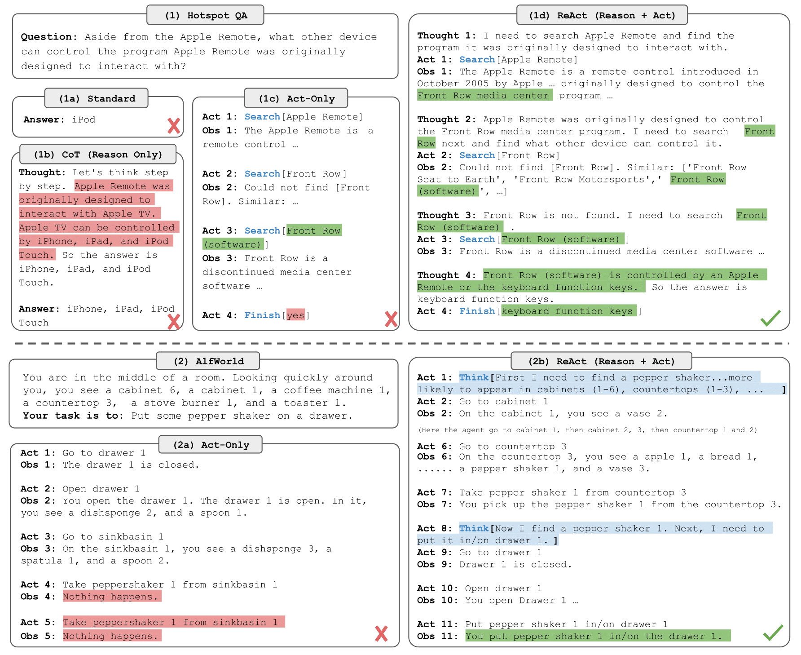

# 【麻瓜读论文】LLM 升级到 AGI 的可能必备 Prompt 框架 —— ReAct

> 麻瓜读论文系列是由闪闪团队出品的系列文章，旨在帮助非机器学习等“深奥”计算机科学研究者更好地理解 GPT，会详细解读最新的 GPT 相关的重要论文。
> 
> 
> 这里不会过多地关注技术/算法/数学细节，而是更多地关注「发生了什么」、「怎么做到的」、「可能的影响」等。
> 
> 如果你对于该系列文章有好的想法、建议，或者你也想要投稿，可以关注公众号「闪闪 SparkAI」。
> 

# 论文信息

论文链接：

****ReAct: Synergizing Reasoning and Acting in Language Models****

[https://arxiv.org/abs/2210.03629](https://arxiv.org/abs/2210.03629)

论文基本信息：

- 标题：ReAct：在语言模型中协同推理和行动
- 作者：[Shunyu Yao](https://arxiv.org/search/cs?searchtype=author&query=Yao%2C+S), [Jeffrey Zhao](https://arxiv.org/search/cs?searchtype=author&query=Zhao%2C+J), [Dian Yu](https://arxiv.org/search/cs?searchtype=author&query=Yu%2C+D), [Nan Du](https://arxiv.org/search/cs?searchtype=author&query=Du%2C+N), [Izhak Shafran](https://arxiv.org/search/cs?searchtype=author&query=Shafran%2C+I), [Karthik Narasimhan](https://arxiv.org/search/cs?searchtype=author&query=Narasimhan%2C+K), [Yuan Cao](https://arxiv.org/search/cs?searchtype=author&query=Cao%2C+Y)
- 摘要：
    
    > 尽管大型语言模型（LLMs）在语言理解和交互决策等任务中展示了令人印象深刻的能力，但其推理（例如思维链提示）和行动（例如行动计划生成）的能力主要被研究为单独的主题。在本文中，我们探讨了LLMs在交错方式下生成推理追踪和任务特定行动的用途，允许两者之间产生更大的协同作用：推理追踪帮助模型诱导、跟踪和更新行动计划，以及处理异常情况，而行动使其能够与外部来源（例如知识库或环境）接口，以收集额外信息。我们将我们的方法命名为ReAct，并将其应用于各种语言和决策任务，并证明其比最先进的基线方法更有效，同时比没有推理或行动组件的方法具有更好的人类可解释性和可信度。具体而言，在问答（HotpotQA）和事实验证（Fever）方面，ReAct通过与简单的维基百科API交互，克服了思维链推理中普遍存在的幻觉和错误传播问题，并生成更具可解释性的类人任务解决轨迹。在两个交互决策基准测试（ALFWorld和WebShop）中，ReAct的成功率分别比模仿学习和强化学习方法高出34％和10％，同时仅提示一个或两个上下文示例。
    > 

# 麻瓜解读

## 发生甚摸事了？

并非新闻，前几天 Auto-GPT 爆火，而我们来看看其中最基础的组件之一：ReAct。

这个组件的相关文章是 Google Research 的 Brain Team 出品的，在 2022 年 10 月就提交了，虽然不太被人提及，但显然这种方法成为了当下火爆的各种产品的坚强后盾。

## 怎么做的（论文速读）

ReAct = Reasoning（协同推理） + Acting（行动）

因为整个方法操作起来比较简单，论文中其实没有太多提及具体的操作步骤，更多地在介绍与 CoT、Fine Tuning 等方式的效果对比。

所以作者在这里简要介绍一下这个框架的思想，其实从下面这张图就能看出来，在 Prompt 的时候包含几个元素：

1. **思考（Thought）：推理过程的文字展示**，我要干什么，或者说我想要 LLM 帮我做什么，以及为了达成这件事情所需要的前置条件是什么；
2. **行动（Act）：生成与外部交互的指令**，确定这一步要做什么之后所生成的对应行为指令文字，比如遇到了 LLM 没有预设的知识，要进行搜索；
3. **观察（Obs）：从外部获取执行指令得到的结果**，相当于拿到当前这一步的行为的结果，准备进行下一步，比如如果是搜索的话，这里就会是搜索结果；

## 可能造成的影响

在这篇文章中探讨了大语言模型思考并执行外部任务，允许两者之间产生更大的协同作用：推理追踪帮助模型诱导、跟踪和更新行动计划，以及处理异常情况，而行动使其能够与外部来源（例如知识库或环境）接口，以收集额外信息。

更直白地讲，让 ChatGPT 本身可以与现实世界交互，获取信息、操作物品，更像一个新世代的人工智能了。

Auto-GPT 便是参考了当前的框架，从而表现的非常出色。在未来如果 LLM 要成为 AGI，也许这个框架是一个基础的行动框架，而如果需要在机器人或者复杂的虚拟环境中使用 GPT 来做为大脑，让它自己思考、生成行动、获取执行后的结果、再次思考并计划下一步这样的路径必不可少。

# 论文正文中译

## 摘要

略

## 1 介绍

人类智能的一个独特特征是能够无缝地将面向任务的动作与口头推理（或内部语言，Alderson-Day＆Fernyhough，2015）相结合，这已被理论化为促进自我调节或战略化（Vygotsky，1987; Luria，1965; Fernyhough，2010）和维持工作记忆（Baddeley，1992）的人类认知中发挥重要作用。考虑在厨房里做菜的例子。在任何两个具体的行动之间，我们可能会用语言推理来跟踪进展（“现在所有东西都切好了，我应该把锅里的水烧热”），处理异常情况或根据情况调整计划（“我没有盐，所以让我用酱油和胡椒代替”），并意识到需要外部信息的时候（“我该如何准备面团？让我在互联网上搜索”）。我们也可以采取行动（打开烹饪书阅读食谱，打开冰箱，检查成分）来支持推理并回答问题（“我现在能做什么菜？”）。这种“行动”和“推理”之间的紧密协作使人类能够快速学习新任务，并在以前未见过的情况或面临信息不确定性时进行强大的决策或推理。

最近的研究结果暗示了将语言推理与自主系统中的交互式决策制定相结合的可能性。一方面，适当提示的大型语言模型（LLMs）已经展示了从算术、常识和符号推理任务的问题中执行几步推理过程以推导答案的新兴能力（Wei等，2022）。然而，这种“思维链”推理是一个静态的黑匣子，因为模型使用自己的内部表示来生成思想，并且没有基于外部世界，这限制了它反应性地推理或更新其知识的能力。这可能会导致问题，如事实幻觉和推理过程中的错误传播（图1（1b））。另一方面，最近的研究探讨了预训练语言模型在交互环境中进行规划和行动的使用（Ahn等，2022; Nakano等，2021; Yao等，2020; Huang等，2022a），重点是通过语言先验来预测行动。这些方法通常将多模态观察转换为文本，使用语言模型生成领域特定的行动或计划，然后使用控制器选择或执行它们。然而，它们没有使用语言模型抽象地推理高级目标或维护工作记忆以支持行动，除了Huang等人。 （2022b）执行有限形式的口头推理，以重申有关当前状态的空间事实。除了与几个块互动的这种简单的具体任务外，还没有研究如何以协同的方式将推理和行动结合起来进行一般任务解决，以及这种组合是否可以带来与单独推理或行动相比的系统性好处。

图1: (1) 比较4种提示方法，(a) 标准，(b) 思维链 (CoT,仅原因)，(c) 仅行动，和(d) ReAct (原因+行动)，解决HotpotQA (Yang et al., 2018)问题。(2) 比较(a) 仅行动和(b) ReAct提示来解决AlfWorld (Shridhar et al., 2020b)游戏。在两个领域中，我们省略了提示中的上下文示例，仅显示模型 (行动、思考) 和环境 (观察) 生成的任务解决轨迹。

在这项工作中，我们提出了ReAct，一种将语言模型与推理和行动相结合以解决不同语言推理和决策制定任务的通用范例（图1）。 ReAct交替提示LLMs生成与任务相关的口头推理和行动，这使得模型能够进行动态推理以创建、维护和调整高级计划以进行行动（推理以行动为目的），同时与外部环境（例如维基百科）交互以将其他信息纳入推理（从行动中推理）。

## 2 REACT：协同推理（REasoning）+行动（ACTing）

考虑一个智能体与环境交互以解决任务的一般设置。在时间步骤t，智能体从环境接收到一个观察ot ∈ O，并采取一个行动at ∈ A，遵循某些策略π(at|ct)，其中ct = (o1, a1, · · · , ot−1, at−1, ot)是智能体的上下文。当映射ct 7→ at高度隐式且需要广泛计算时，学习策略是具有挑战性的。例如，图1(1c)中显示的智能体无法生成正确的最终动作(Act 4)完成QA任务，因为它需要在轨迹上下文(Question, Act 1-3, Obs 1-3)上进行复杂的推理。同样，图1(2a)中显示的智能体无法从上下文中理解到sinkbasin 1不包含peppershaker 1，因此继续产生幻觉般的行动。

ReAct的思想很简单：我们增加智能体的行动空间到Aˆ = A ∪ L，其中L是语言空间。语言空间中的行动aˆt，我们将其称为思考或推理痕迹，不会影响外部环境，因此不会产生观察反馈。相反，思考aˆt旨在通过对当前上下文ct进行推理来组合有用的信息，并更新上下文ct+1=(ct, aˆt)以支持未来的推理或行动。如图1所示，可能存在各种类型的有用思考，例如分解任务目标并创建行动计划(2b, Act 1; 1d, Thought 1)，注入与任务解决相关的常识知识(2b, Act 1)，从观察中提取重要部分(1d, Thought2, 4)，跟踪进展和过渡行动计划(2b, Act 8)，处理异常并调整行动计划(1d, Thought 3)等等。

然而，由于语言空间L是无限的，学习这种增强的行动空间是困难的，并且需要强大的语言先验知识。在本文中，我们主要关注的设置是，一个冻结的大型语言模型PaLM-540B (Chowdhery et al., 2022)1，通过少样本的上下文示例来生成领域特定的行动和自由形式的语言思考，以解决任务(Figure 1 (1d)，(2b))。每个上下文示例是一个人类行动、思考和环境观察的轨迹，用于解决一个任务实例(请参阅附录C)。对于需要推理的任务(图1(1))，我们交替生成思考和行动，以便任务解决轨迹包含多个思考-行动-观察步骤。相反，对于可能涉及大量行动的决策任务(图1(2))，思考只需要在轨迹的最相关位置稀疏出现，因此我们让语言模型决定思考和行动的异步发生。由于决策制定和推理能力集成到一个大型语言模型中，ReAct具有几个独特的特点：

A）直观易用：设计ReAct提示很简单，因为人类注释者只需在他们采取的行动之上以语言方式记录下他们的思考。本文中没有使用任何特定的格式选择、思考设计或示例选择。我们在第3和第4节中详细介绍了每个任务的提示设计。

B）通用和灵活：由于思考空间和思考-行动发生格式的灵活性，ReAct适用于具有不同行动空间和推理需求的各种任务，包括但不限于QA、事实验证、文本游戏和Web导航。

C）性能和鲁棒性：ReAct展现出对新任务实例的强大泛化能力，而仅从一个到六个上下文示例中学习，始终在不同领域的推理或行动中表现优异。在第3节中，我们还展示了启用微调时的额外收益，在第4节中展示了ReAct性能对提示选择的鲁棒性。

D）与人类对齐和可控性：ReAct承诺一种可解释的顺序决策制定和推理过程，人类可以轻松地检查推理和事实正确性。此外，人类还可以通过思考编辑来控制或纠正代理行为，如第4节中的图5所示。

## 3 知识密集型推理任务

我们从像多跳问答和事实验证这样的知识密集型推理任务开始。如图1（1d）所示，通过与维基百科API交互，ReAct能够检索支持推理的信息，同时使用推理来确定下一步要检索什么，展示了推理和行动之间的协同作用。

### 3.1 初始设置

***领域*** 我们考虑两个具有挑战性的知识检索和推理数据集：（1）HotPotQA（Yang等人，2018），一个需要在两个或更多维基百科段落上进行推理的多跳问答基准测试，以及（2）FEVER（Thorne等人，2018），一个事实验证基准测试，其中每个声明都被注释为SUPPORTS，REFUTES或NOT ENOUGH INFO，基于是否存在维基百科段落来验证声明。在这项工作中，我们针对这两个任务采用仅问题的设置，模型仅接收问题/声明作为输入，没有支持段落的访问，并且必须依靠其内部知识或通过与外部环境交互来支持推理。

***操作空间*** 我们设计了一个简单的维基百科Web API，具有三种类型的操作，以支持交互式信息检索：（1）搜索[实体]，如果存在相应实体的维基百科页面，则返回前5个句子，否则建议从维基百科搜索引擎中选择前5个相似实体，（2）查找[字符串]，它将返回包含字符串的页面中的下一个句子，模拟浏览器上的Ctrl+F功能。（3）完成[答案]，这将完成当前任务并给出答案。我们注意到，这个行动空间大多只能基于确切的段落名称检索到一小部分段落，这比最先进的词汇或神经检索器要弱得多。目的是模拟人类如何与维基百科进行交互，并强制模型通过语言中的显式推理来检索。

### 3.2 方法

***ReAct提示：***对于HotpotQA和Fever，我们从训练集中随机选择6和3个案例2，并手动组成ReAct格式轨迹，以作为提示的少量样本。类似于图1（d），每个轨迹由多个思考-行动-观察步骤（即密集思考）组成，其中自由形式的思考用于各种目的。具体来说，我们使用一组思考来分解问题（“我需要搜索x，找到y，然后找到z”），从维基百科观察中提取信息（“x始于1844年”，“该段落未提到x”），执行常识（“x不是y，所以z必须是...”）或算术推理（“1844<1989”），指导搜索重构（“也许我可以搜索/查找x”），并综合最终答案（“...所以答案是x”）。更多细节见附录C。

***基线：***我们系统地削弱ReAct轨迹，构建多个基线的提示（格式如图1（1a-1c））：（a）标准提示（Standard），它删除了ReAct轨迹中的所有思考、行动和观察。 （b）思维链提示（CoT）（Wei等人，2022），它删除了行动和观察，并作为仅推理的基线。我们还通过在推理期间使用解码温度为0.7的21个CoT轨迹进行抽样并采用多数答案来构建自一致性基线（CoT-SC）（Wang等人，2022a;b），发现它能够提高CoT的性能。 （c）仅操作提示（Act），它删除了ReAct轨迹中的思考，粗略地类似于WebGPT（Nakano等人，2021）与互联网交互以回答问题，虽然它执行不同的任务和行动空间，并使用模仿和强化学习而不是提示。

***结合内部和外部知识：***如将在第3.3节中详细说明，我们观察到ReAct所展示的问题解决过程更加事实和基础，而CoT在制定推理结构方面更加准确，但容易受到虚构的事实或思想的影响。因此，我们建议将ReAct和CoT-SC结合起来，并让模型根据以下启发式决定何时切换到其他方法：A）ReAct→CoT-SC：当ReAct在给定步骤内无法返回答案时，回退到CoT-SC。我们将HotpotQA和FEVER分别设置为7步和5步，因为我们发现步骤更多不会提高ReAct的性能3。B）CoT-SC→ReAct：当n个CoT-SC样本中的多数答案出现少于n/2次时（即内部知识可能不会自信地支持任务），回退到ReAct。

***微调：***由于在规模上手动注释推理跟踪和操作的挑战，我们考虑一种类似于Zelikman等人（2022）的引导方法，使用由ReAct（也适用于其他基线）生成的3,000个具有正确答案的轨迹来微调较小的语言模型（PaLM-8/62B）以解码轨迹（所有思考，行动，观察）条件为输入问题/声明。更多细节见附录B.1。

### 3.3 结果和观察

ReAct在表现上始终优于Act 表1显示了使用PaLM540B作为基础模型的不同提示方法的HotpotQA和Fever结果。我们注意到，ReAct在两个任务上均优于Act，展示了推理指导操作的价值，特别是在综合最终答案方面，如图1（1c-d）所示。微调结果3也证实了推理跟踪对于更具信息的操作的益处。

表2：ReAct和CoT在HotpotQA上的成功和失败模式类型，以及人类随机选择样例中的百分比。

ReAct与CoT相比，在Fever上表现更好（60.9 vs. 56.3），但在HotpotQA上略逊于CoT（27.4 vs. 29.4）。Fever中的SUPPORTS/REFUTES声明可能只有轻微差异（见附录D.1），因此检索准确和最新的知识至关重要。为了更好地理解ReAct和CoT在HotpotQA上的行为差异，我们分别从ReAct和CoT中随机抽取了50个具有正确和错误答案（由EM判断）的轨迹（因此总共有200个示例），并在表2中手动标记了它们的成功和失败模式。以下是一些关键观察结果：

A）幻觉是CoT的严重问题，导致其成功模式中的假阳性率远高于ReAct（14％ vs. 6％），并构成其主要失败模式（56％）。相比之下，ReAct的问题解决轨迹更加扎实、以事实为导向、值得信赖，这要归功于其接触外部知识库。

B）虽然交错推理、行动和观察步骤可以改善ReAct的扎实性和可信度，但这样的结构约束也降低了其制定推理步骤的灵活性，从而导致推理错误率高于CoT。我们注意到，有一种ReAct特定的频繁错误模式，即模型反复生成以前的思想和行动，我们将其归类为“推理错误”的一部分，因为模型无法推理出下一步合适的行动并跳出循环4。

C）对于ReAct，通过搜索成功检索信息性知识至关重要。23％的错误情况是由于非信息性搜索，这会使模型的推理偏离轨道，使其难以恢复和重新制定思路。这可能是事实性和灵活性之间的一种预期权衡，这激发了我们提出的两种方法的策略结合。
我们在附录E.1中提供了每种成功和失败模式的示例。我们还发现，一些HotpotQA问题可能包含过时的答案标签，例如图4所示。

ReAct + CoT-SC对促进LLMs效果最佳 正如表1所示，在HotpotQA和Fever上，最佳的提示方法分别为ReAct → CoT-SC和CoT-SC → ReAct。此外，图2显示了不同方法在使用不同数量的CoT-SC样本时的表现。虽然两种ReAct + CoT-SC方法在各自的任务中具有优势，但它们都显著并一致地优于CoT-SC，跨越不同数量的样本，仅使用3-5个样本即可达到CoT-SC的性能。这些结果表明，合理地结合模型内部知识和外部知识对于推理任务至关重要。

ReAct在微调中表现最佳 图3显示了四种方法（标准、CoT、Act、ReAct）在HotpotQA上提示/微调的扩展效果。使用PaLM-8/62B，由于难以从上下文示例中学习推理和行动，因此提示ReAct是四种方法中表现最差的。然而，当仅使用3,000个示例进行微调时，ReAct在四种方法中成为最佳方法，PaLM-8B微调ReAct在所有PaLM-62B提示方法中表现最佳，而PaLM-62B微调ReAct在所有540B提示方法中表现最佳。相反，对于PaLM8/62B，标准或CoT的微调明显劣于ReAct或Act的微调，因为前者本质上是教模型记忆（可能是幻觉的）知识事实，而后者教模型如何（推理和）行动以从维基百科中获取信息，这是一种更可推广的知识推理技能。由于所有提示方法仍然远远落后于特定领域的最新方法（表1），我们认为使用更多人工编写的数据进行微调可能是释放ReAct力量的更好方法。

图3：使用ReAct（我们的方法）和基线模型，对HotPotQA进行提示和微调的缩放结果。

## 4 个决策任务

我们还在两个基于语言的交互式决策任务ALFWorld和WebShop上测试了ReAct，这两个任务都具有复杂的环境，需要智能体在长时间内进行行动和探索，以获得稀疏的奖励，因此需要推理来有效地行动和探索。

***ALFWorld：***ALFWorld（Shridhar等人，2020b）（图1（2））是一个合成的基于文本的游戏，旨在与具体化的ALFRED基准（Shridhar等人，2020a）相一致。它包括6种类型的任务，智能体需要通过文本操作（例如，去到咖啡桌1，取走纸2，使用桌灯1）导航和与模拟家庭进行交互，以实现高级目标（例如，在桌灯下检查纸） 。一个任务实例可能有50多个位置，并且需要一个专家策略超过50步才能解决，因此挑战智能体规划和跟踪子目标，以及系统地探索（例如，逐个检查所有桌子是否有桌灯）。特别是，ALFWorld内置的一个挑战是需要确定常见家庭物品的可能位置（例如，桌灯可能在桌子、货架或梳妆台上），因此这个环境非常适合LLMs利用其预训练的常识知识。为了促使ReAct，我们随机注释了每个任务类型的三条轨迹，其中每个轨迹包括稀疏的思考，其中（1）分解目标，（2）跟踪子目标完成，（3）确定下一个子目标，以及（4）通过常识推理找到一个对象以及该怎么做。我们在附录C.4中展示了用于ALFWorld的提示。按照Shridhar等人（2020b）的方法，我们在特定于任务的设置中评估134个未见过的评估游戏。为了提高鲁棒性，我们通过我们注释的3个轨迹的每个排列构造了每个任务类型的6个提示。使用相同的轨迹构造Act提示，但不使用思考-由于任务实例是从训练集中随机选择的，因此既不偏向ReAct也不偏向Act，并提供公平和可控的比较，以测试稀疏思考的重要性。对于基线，我们使用BUTLER（Shridhar等人，2020b），这是一个通过对每种任务类型的105个专家轨迹进行训练的模仿学习代理。

***WebShop：***ReAct也可以与嘈杂的现实语言环境进行互动，以用于实际应用吗？我们调查了WebShop（Yao等人，2022），这是一个最近提出的在线购物网站环境，拥有1.18M个真实世界的产品和12k个人类指令。与ALFWorld不同，Webshop包含各种结构化和非结构化文本（例如，从亚马逊爬取的产品标题、描述和选项），并要求智能体根据用户指令（例如，“我正在寻找一个带抽屉的床头柜。它应该有一种镍涂层，价格低于140美元”）通过网络交互来购买产品（例如，搜索“床头柜抽屉”，选择按钮，如“颜色：现代镍白色”或“返回搜索”）。该任务通过平均分数（选择的产品中所有剖面所需属性的百分比的平均值）和成功率（所选产品满足所有要求的情况下的剖面百分比）在500个测试指令上进行评估。我们用用于搜索、选择产品、选择选项和购买的Act提示来制定Act提示，使用ReAct提示还需要推理确定要探索什么，何时购买以及哪些产品选项与指令相关。请参见表6中的示例提示，以及附录中的表10中的模型预测。我们与使用1,012个人类注释的轨迹进行训练的模仿学习（IL）方法进行比较，以及使用10,587个训练指令进行训练的模仿+强化学习（IL + RL）方法。

结果显示，ReAct在ALFWorld（表3）和Webshop（表4）上的表现均优于Act。在ALFWorld上，最佳的ReAct试验取得了71％的平均成功率，显著优于最佳的Act（45％）和BUTLER（37％）试验。事实上，即使是最差的ReAct试验（48％），也能击败两种方法的最佳试验。此外，ReAct相对于Act的优势在六个受控试验中保持一致，相对性能提升范围从33％到90％，平均为62％。从质量上看，我们发现，即使没有任何思考，Act也无法正确地将目标分解为更小的子目标，或者失去了对环境当前状态的掌控。比较ReAct和Act的示例轨迹可以在附录D.2.1和附录D.2.2中找到。

在Webshop上，一次性Act提示已经与IL和IL + RL方法相当。通过额外的稀疏推理，ReAct实现了显着更好的性能，相对于先前最佳成功率，绝对提高了10％。通过检查示例，我们发现，ReAct更有可能通过推理来填补嘈杂的观察和行动之间的差距（例如，“对于‘用于客厅的节省空间的垫凳’，项目有‘39x18x18英寸’和‘蓝色’的选项，看起来很不错。”），从而识别与指令相关的产品和选项。但是，现有方法仍远未达到专家人类的表现水平（表4），他们执行的产品探索和查询重构显然仍然对基于提示的方法构成挑战。

关于内部推理与外部反馈的价值据我们所知，ReAct是首个在交互式环境中应用LLM实现联合推理和行动的示例，它在闭环系统中得以应用。也许最接近的先前工作是Huang等人（2022b）的Inner Monologue（IM），其中一个具有身体的代理的行动是由“内心独白”所激发的。但是，IM的“内心独白”仅限于对环境状态的观察和代理完成目标所需的内容。相比之下，ReAct中的决策制定推理追踪是灵活和稀疏的，允许为不同任务引入多样化的推理类型（见第2节）。

为了展示ReAct与IM之间的差异，并强调内部推理与简单反应外部反馈的重要性，我们进行了一个消融实验，使用了一种由IM样式的密集外部反馈构成的思考模式。如表3所示，ReAct在整体成功率上显著优于IM样式的提示（ReAct-IM）（71与53），在六项任务中有五项保持一致的优势。从质量上看，我们观察到，由于缺乏高层次的目标分解，ReAct-IM经常犯错，无法确定何时完成子目标或下一个子目标应该是什么。此外，许多ReAct-IM轨迹难以确定ALFWorld环境中一个物品可能会在哪里，因为缺乏常识推理。这两个缺陷可以在ReAct范式中解决。关于ReAct-IM的更多详细信息，请参见附录B.2。ReAct-IM的一个示例提示可以在附录C.4中找到，一个示例轨迹可以在附录D.2.3中找到。

## 5 相关工作

***语言模型用于推理：***使用 LLMs 进行推理的最著名的工作可能是 Chain-of-Thought (CoT) (Wei 等人，2022)，它揭示了 LLMs 制定自己的“思考过程”来解决问题的能力。随后进行了几项后续工作，包括用于解决复杂任务的从最少提示到最多提示 (Zhou 等人，2022)，零-shot CoT (Kojima 等人，2022) 和自一致性推理 (Wang 等人，2022a)。最近，(Madaan & Yazdanbakhsh，2022) 系统地研究了 CoT 的制定和结构，观察到符号、模式和文本的存在对 CoT 的有效性至关重要。其他工作还扩展到更复杂的推理架构，超出了简单提示的范畴。例如，Selection-Inference (Creswell 等人，2022) 将推理过程分为“选择”和“推理”两个步骤。STaR (Zelikman 等人，2022) 通过对模型本身生成的正确理由进行微调，启动推理过程。忠实推理 (Creswell & Shanahan，2022) 将多步推理分解成三个步骤，分别由专用的 LM 执行。类似的方法如 Scratchpad (Nye 等人，2021)，它在中间计算步骤上微调 LM，也展示了在多步计算问题上的改进。与这些方法不同，ReAct 不仅仅执行孤立的、固定的推理，还将模型动作及其相应的观察整合成一系列连贯的输入，使模型可以更准确地推理并处理超出推理范畴的任务（例如交互式决策）。

***语言模型用于决策：***LLMs 的强大能力使它们能够执行超出语言生成的任务，越来越流行的是利用 LLMs 作为决策制定的策略模型，特别是在交互环境中。WebGPT (Nakano 等人，2021) 使用 LM 与 Web 浏览器交互，浏览网页，并从 ELI5 (Fan 等人，2019) 推断出复杂问题的答案。与 ReAct 相比，WebGPT 没有明确地建模思考和推理过程，而是依赖于昂贵的人类反馈进行强化学习。在会话建模方面，像 BlenderBot (Shuster 等人，2022b) 和 Sparrow (Glaese 等人，2022) 这样的聊天机器人和像 SimpleTOD (Hosseini-Asl 等人，2020) 这样的面向任务的对话系统也训练 LMs 进行 API 调用决策。与 ReAct 不同的是，它们没有明确考虑推理过程，也依赖于昂贵的数据集和人类反馈收集进行策略学习。相比之下，ReAct 以更便宜的方式学习策略，因为决策过程只需要推理过程的语言描述。

LLMs 还越来越多地应用于交互和具身环境中的规划和决策。在这方面与 ReAct 最相关的可能是 SayCan (Ahn 等人，2022) 和 Inner Monologue (Huang 等人，2022b)，它们使用 LLMs 进行机器人行动规划和决策。在 SayCan 中，LLMs 被提示直接预测机器人可以采取的可能行动，然后通过基于视觉环境的 affordance 模型进行重新排序，以进行最终预测。Inner Monologue 通过添加同名的“内心独白”，即从环境中注入的反馈，进一步改进了这一过程。据我们所知，Inner Monologue 是第一个展示这种闭环系统的工作，ReAct 建立在此基础上。然而，我们认为 Inner Monologue 并不真正包含内心思维——这在第 4 节中有详细阐述。我们还注意到，在交互决策过程中利用语言作为语义丰富的输入已经在其他环境中被证明是成功的 (Abramson 等人，2020；Karamcheti 等人，2021；Huang 等人，2022a；Li 等人，2022)。越来越明显的是，在 LLMs 的帮助下，语言作为一种基本的认知机制将在交互和决策制定中发挥关键作用。此外，LLMs 的进展也启发了像 Reed 等人 (2022) 这样的通用代理的发展。

## 6 结论

我们提出了 ReAct——一种简单而有效的方法，用于协同推理和行动的大型语言模型。通过多种多跳问题回答、事实检查和交互式决策制定任务的实验，我们展示了 ReAct 可以提供卓越的性能和可解释的决策跟踪。尽管我们的方法很简单，但在具有大型动作空间的复杂任务中，需要更多的演示来学习得更好，这可能很容易超出上下文学习的输入长度限制。我们探讨了在 HotpotQA 上的微调方法，初步结果很有前途，但从更高质量的人类注释中学习将是进一步提高性能的必要条件。通过多任务训练扩展 ReAct，并将其与强化学习等补充范例相结合，可以产生更强大的代理，进一步释放 LLMs 在更多应用中的潜力。